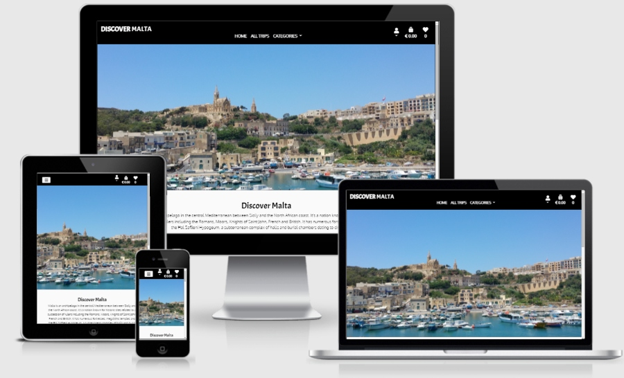
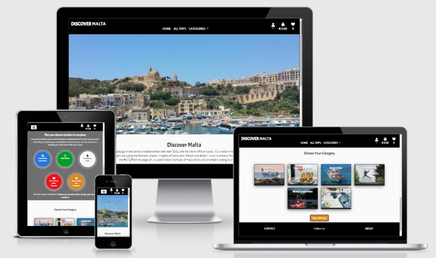
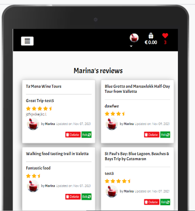
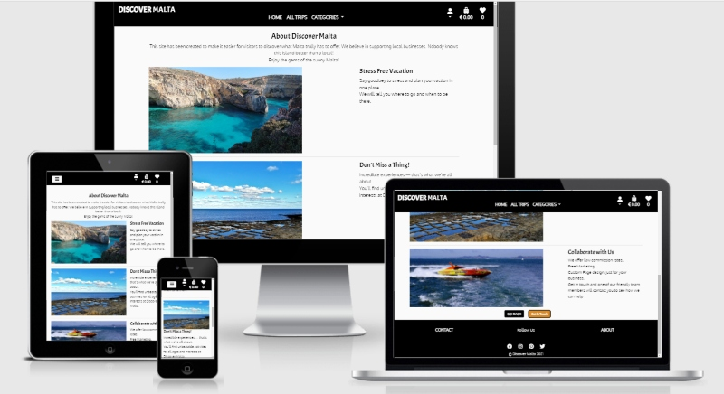

# Discover Malta

[View the deployed project here](https://discover-malta.herokuapp.com/)

I have created this e-commerce/booking site as part of my final Milestone 4 project for Code Institute, 
focusing on Full Stack Web Development using HTML, CSS, JavaScript, jQuery, Python, Django and Postgresql.

Discover Malta site offers the user the ability to discover the beautiful island of Malta and plan their holiday antennary on one platform. The site offers the user quick and easy checkout, instant ticket confirmation, a gallery of trips and some useful information that they need during their stay. 

The main objective of this site is to support local tour operators by reducing their wage cost, offering custom page design for each trip and easy online transactions. Taking the hustle of marketing and organization away, letting the business owners focus on delivering an outstanding experience to our clients.

# Table of Content

1 [**Project Goals**](#project-goals)

2 [**UX**](#ux)
   - [**User Goals**](#user-goals)
   - [**Client Goals**](#client-goals)
   - [**Business Goals**](#business-goals)

3 [**User Stories**](#user-stories)
   - [**First Time User**](#first-time-user)
   - [**Returning User**](#returning-user)
   - [**Frequent User**](#frequent-user)
   - [**Potential Client**](#potential-client)
   - [**Business goals**](#business-goals)

4 [**User Requirements and Expectations**](#user-requirements-and-expectations)
   - [**Requirements**](#requirements)
   - [**Expectations**](#expectations)

5 [**Design**](#design)
   - [**Colour Scheme**](#colour-scheme)
   - [**Typography**](#typography)
   - [**Imagery**](#imagery)
   - [**Icons**](#icons)
   - [**Style**](#style)

6 [**Wireframes and Data Modal**](#wireframes-and-data-modal)
   - [**Wireframes**](#wireframes)
   - [**Database modal**](#database-modal)
      - [**Database Choices**](#database-choices)
      - [**Data Models**](#data-models)

7 [**Features**](#features)
   - [**All Pages**](#all-pages)
   - [**Home Page**](#home-page)
   - [**All Trips Page**](#all-page)
   - [**Trip Details Page**](#trip-details-page)
   - [**Add Trip Page**](#add-trip-page)
   - [**Update Trip Page**](#update-trip-page)
   - [**Delete Trip**](#delete-trip)
   - [**Login Page**](#login-page)
   - [**Registration Page**](#registration-page)
   - [**Forgot Password Page**](#forgot-password-page)
   - [**Reset Password Page**](#reset-password-page)
   - [**Logout**](#logout)
   - [**Profile Page**](#profile-page)
   - [**Edit Profile Page**](#edit-profile-page)
   - [**View Review Page**](#view-review-page)
   - [**Edit Review Page**](#edit-review-page)
   - [**Favourites Page**](#favourites-page) 
   - [**View Bag Page**](#view-bag-page) 
   - [**Checkout Page**](#checkout-page) 
   - [**Checkout Success Page**](#checkout-success-page) 
   - [**Contact Page**](#contact-page)
   - [**About Page**](#about-page)
   - [**404 Error Page**](#404-error-page)
   - [**500 Error Page**](#500-error-page)
   - [**Features Left to Implement**](#features-left-to-implement)

8 [**Technology Used**](#technology-used)
   - [**Languages Used**](#language-used)
   - [**Frameworks and Libraries**](#frameworks-and-libraries)
   - [**Tools**](#tools) 

9 [**Testing**](#testing)
   - [TESTING.md file](TESTING.md)

10 [**Deployment**](#deployment)
   - [**Deployment Steps**](#deployment-steps)
   - [**AWS**](#aws)
   - [**Heroku and AWS**](#heroku-and-aws)
   - [**Clone this project**](#clone-this-project)
   - [**Fork this project**](#fork-this-project)
   
11 [**Credits**](#credits)
   - [**Content**](#content)
   - [**Code**](#code)
   - [**Media**](#media)
   - [**Acknowledgement**](#acknowledgement)

12 [**Disclaimer**](#disclaimer)

## Project Goals 

- This is an e-commerce/trip-booking website specially focused on the Maltese tourist market. Malta is a nation of just under 450,000 people, yet its infrastructure is required to support over 1.1 million tourists every year.

#### The main target audience of Discover Malta are: 
-	Inbound tourists aged 25 to 44 years comprised the largest age group of tourists arriving in - Malta in 2020. In that year, roughly 273 thousand international travellers within this age group visited the country.
-	Families who are looking for children-friendly activities
-	Couples who are looking to explore different parts of the island
-	People looking for unique experiences during their holidays
-   Tourists looking to book and organize their holiday before arriving at their destination
-   Tourists and locals looking for last-minute deals.
 

##### back to [content](#table-of-content)

## UX

### User Goals:

-	Explore different trips which are available during their stay
-	Shortlist their favourite trips
-	Browse through different trips and experiences
-	Be able to navigate the site easily, find what they need and make a safe and secure purchase.
-	Easy and quick checkout
-	Instant email confirmation
-	The website has to be easy to navigate and be responsive across all screen size devices
-	Login procedure should be simple and feedback should be given when appropriate

####  Discover Malta travel site is a great way to meet these needs because: 
-	The site has been designed with the user experience in mind, from easy navigation, responsive design to user feedback guiding them every step of the way.
-	Discover Malta trips can be searched by keywords or categories giving the user freedom to explore their desired destination
-   The user is also able to sort trips by different criteria like (price, reviews, family-friendly and duration)
-   Once the user is logged in, they will be able to shortlist trips and view them in their profile
-	Easy and quick checkout process with instant email confirmation
-	User may access their tickets via the Profile portal
-   Login procedure is designed with user goals in mind, allowing the user to log in with their email address, reset password and update their profile.

##### back to [content](#table-of-content)

### Client Goals
A potential client which chooses to collaborate with Discover Malta might want to 
-	Advertise their trips on the web
-	Showcase their experience to the potential clients 
-	Sell their tickets on the web 
-	Increase their business demand 
-	Reduce their overheads

#### Discover Malta travel site is a great way to meet these needs because: 
-	A potential client can easily request more information by filling in the contact form.
-	Discover Malta offers low commission rates, custom design and availability.
-	The client may also increase or decrease their trip availability at any time. 

##### back to [content](#table-of-content)

### Business Goals
-	Provide a professional online booking platform that helps the user to feel safe that they are buying from a trustworthy source.
-	Build brand awareness by including all the branding photographs, colours, fonts and logos associated with the Discover Malta brand.
-	Connect with users of the platform via social media channels
-	Keep track of sales data to inform future trip choices.
-	Make sales of products easy for buyers to increase sales conversion.
-	Engage with users by asking them to supply their trip reviews
-	Drive traffic and create awareness by advertising on social media channels 
-	Supply a platform for small business owners to advertise and increase their sales

##### back to [content](#table-of-content)

### User Stories 

#### First Time User

1.	As a first time user, I want to understand what this site is about.
2.	As a first time user, I want to browse through the trips available on site.
3.	As a first-time user, I want to see full trip details and trip reviews from other users.
4.  As a first-time user, I want to understand the benefits of booking my holiday itinerary with the provider.
5.  As a first-time user, I want to add the trips which I like to my favourites.
6.  As a first-time user, I want to find a variety of experiences suited for different ages and requirements.
7.  As a first-time user, I want to navigate the site easily and view the site on different screen sizes.
8.  As a first-time user, I want to have a good overview of what the site has to offer and then click on the button to view more information about a specific trip if interested.

##### back to [content](#table-of-content)

#### Returning User 

1.	As a returning user, I want to be able to login into my account
2.	As a returning time user, I want to view my favourites and check their availability
3.	As a returning user, I want to search for a specific trip or filter trips by category.
4.	As a returning user, I want to learn more about the site.
5.	As a returning user, I want to purchase the trip with secure checkout.
6.	As a returning user, I want to get an instant email confirmation of my transaction.
7.	As a returning user, I want to have feedback provided to me every step of the way.
8.	As a returning user, I want to view my ticket on my profile page.
9.  As a returning user, I want to be able to save my information to my profile for quick and easy checkout next time.

##### back to [content](#table-of-content)

#### Frequent User

1.	As a frequent user, I want to customize my profile page
2.	As a frequent user, I want to view my previous orders
3.	As a frequent user, I want to review the trips which I have been on. 
4.	As a frequent user, I want to be able to update and delete my reviews.
5.	As a frequent user, I want to follow the site on social media.
6.	As a frequent user, I want to be able to contact the site owners if I have an enquire.
7.  As a frequent user, I want to the explore latest deals
8.  As a frequent user, I want my information to be pre-filled on the checkout page.

##### back to [content](#table-of-content)

### Potential Client
1.	As a potential client I want to see a sample of trips to get an overview of what my product might look like
2.	As a potential client I want to learn what benefits are available to me
3.	As a potential client I want to easily get in touch with the site owners to request further information or book a call

##### back to [content](#table-of-content)

### Business goals

1.	As a business owner, I want to provide a platform for users where they explore what Malta has to offer and book their trips during their stay on the island.
2.	As a business owner, I want the user to be able to register with secure login details.
3.	As a business owner, I want the client to be able to use the site easily on any device.
4.	As a business owner, I want to provide useful links to users where they can purchase products and earn an affiliate commission. (shop)
5.	As a business owner, I want to be able to delete any reviews which I consider to be inappropriate or out of content.
6.	As a business owner, I want to be able to add additional new trips to the site. 
7.  As a business owner, I want to be able to edit or delete trips.
8.  As a business owner, I want to provide the user with search and filter functionality for products to enable easy access to the database.

##### back to [content](#table-of-content)

## User Requirements and Expectations

### Requirements:

-	Easy to navigate the site by using buttons
-	Appealing profile page with a functional overview
-	Easy way to view other users reviews 
-	Easy way to add own review 
-	Ability to edit and delete their entities 
-   Secure checkout procedure 
-   Able to save the details for next time  
-   Shortlist trips
-   For the site to give feedback on the interaction

##### back to [content](#table-of-content)

### Expectations: 
 
-	Full trip description
-	Ability to filter trips by category 
-	Ability to search the database for a specific trip by keywords
-	Ability to read other users reviews and add their own 
-	Ability to contact the site owner
-   Ability to cancel a trip within a given period 

##### back to [content](#table-of-content)

## Design 

### Colour Scheme 

-	The colour palette inspiration has come from Luzzu, they date back to the time of the ancient Phoenicians. This gives the site an authentic look and feel.
-   The colour codes used on the site:

| Colour:  | Blue    | Orange  | Red     | Green   | White    | Black   |
| :------: | :-----: | :-----: | :-----: |:------: | :------: | :------:|
| Code:    | #2576da | #da8925 | #ef1018 | #039b2b | #fafafa  | #000000 |

##### back to [content](#table-of-content)

### Typography
      
 [Google Fonts](https://fonts.google.com/) have been used on this page 
    - To give consistency to the users, consistent fonts have been used throughout the site:

      - All the headings are displayed in font-family: 'Acme', sans-serif;

      - All other elements are displayed in font-family: 'Oxygen', sans-serif;
    

##### back to [content](#table-of-content)

### Imagery

#### Carousel images in the index.htm have been sorced from [Pixabay](https://pixabay.com/):

  - Catamaral image [by dimitrisvetsikas1969](https://pixabay.com/photos/catamaran-sea-boat-tourism-blue-2329770/)
  - Gozo image [by waldomiguez](https://pixabay.com/photos/gozo-island-port-malta-water-sea-1139812/)
  - Marsallok [by John Hoefer](https://pixabay.com/photos/boats-port-sea-town-village-5946304/)

#### Category Images:

  - Last minute deals [by veerasantinithi](https://pixabay.com/photos/summer-travel-vacation-holiday-2880261/)
  - Fishing [by dimitrisvetsikas1969](https://pixabay.com/photos/fishing-boat-fisherman-sea-fishing-5736839/)
  - Adventures [by Pixels](https://pixabay.com/photos/woman-jump-backpack-jumping-leap-1868817/)
  - Water activies [by Pixels](https://pixabay.com/photos/woman-kayaking-boat-canoe-canoeing-1867074/)
  - Boat trips [by dimitrisvetsikas1969](https://pixabay.com/photos/sea-water-boat-ship-travel-3703094/)
  - Food and Wine [by atanaspaskalev](https://pixabay.com/photos/luxury-food-wine-rose-starter-4330593/)

#### Trip Images:

   - Walking food tasting trail in Valetta from [malta.com](https://www.malta.com/media/en/dining/restaurant/mosta/ta-marija/maltese-platter-at-ta-marija-mosta.jpg)
   - Ta'Mena Wine Tours [by bedrck](https://pixabay.com/photos/wine-napa-valley-vineyard-napa-1938924/)
   - Blue Grotto and Marsallock half day tour from Valetta [by PICNIC-Foto-Soest](https://pixabay.com/photos/market-fish-fish-market-food-fresh-897990/)
   - Fishing Day Charter [by scottgardner](https://pixabay.com/photos/key-west-florida-fishing-angling-848209/)
   - Fishing Trip Malta and Gozo [by photo-graphe](https://pixabay.com/photos/fish-fishing-fishermen-food-water-1544819/)
   - St Paul's Bay [by kmarius](https://pixabay.com/photos/snorkeling-sea-water-snorkel-ocean-5222196/)
   - Malta: Gozo, Camino and Blue Lagoon Trip [by Marrit1991](https://pixabay.com/photos/crete-boat-sea-fishing-boat-2152796/)
   - Gozo Full Day Jeep Tour with Lunch [by dimitrisvetsikas1969](https://pixabay.com/photos/jeep-vehicle-off-road-adventure-1461830/)
   - Harbour Cruise [by user32212](https://pixabay.com/photos/lighthouse-harbor-port-bay-sky-2482778/)
   - Segway [by Republica](https://pixabay.com/photos/segway-people-ride-sunset-group-88961/)
   - Stand up paddle board yoga [by Trex7875](https://pixabay.com/photos/yoga-on-water-lake-woman-1362019/)
   - Kayak Gozo and Camino [by dimitrisvetsikas1969](https://pixabay.com/photos/canoe-kayak-sport-water-sport-1405961/)

#### About Page:
   
   - Speed Boat [by eyeImage](https://pixabay.com/photos/speedboat-water-boat-ocean-speed-823229/)
   - Sea Caves [by Margaret King](https://pixabay.com/photos/sea-cove-holiday-summer-island-4890410/)
   - Sea Salt [by Andreas64](https://pixabay.com/photos/gozo-salt-pans-sea-heaven-malta-6229702/)

#### 404.html Background Image:

   - Winter Tree Image [by EvgeniT](https://pixabay.com/photos/winter-tree-bench-field-snow-field-3974511/)

#### Default User Profile Image:

- Defaul User Image [by Peggy Marco](https://pixabay.com/illustrations/key-access-password-code-1013662/)

#### 500.html Background Image:

- Lightnening Image [by Felix Mittermeier](https://pixabay.com/photos/lightning-thunderstorm-super-cell-2568381/)

#### Favicon:
     
- Sun in sunglasses [by OpenClippart_Vectors](https://pixabay.com/vectors/sun-cool-sunshine-glossy-smile-151763/)

##### back to [content](#table-of-content)

### Icons

- All the icons on site have been imported from 
[fontawesome](https://fontawesome.com/) library

##### back to [content](#table-of-content)

### Style 

- Subtle box-shadow has been applied on elements that needed the attention of the user like cards and forms. 

- In the case where an area is clickable, for example, links or call to action buttons, the shadow size is increased and animated when the user hovers over the element, this was done to make the area more tempting to click.

- Curved corners styling has been chosen for its friendly feel, and as it is a common stylistic choice of bootstrap it blends well with the style used from that library.

- Call to action buttons and cards all have a black border around them to make them stand out against a neutral background.

- <em>Bootstrap Carousel</em> has been implemented on the home page to display the images of Malta.

- <em>Bootstrap Card</em> was utilized to display a short description of each trip. The card has been also used to display trip reviews with custom sizing of the card.

- <em>Bootstrap Modal</em> has been used for defensive programming when the user is trying to delete a review or a trip to alert the user of their action and ask to confirm their choice. Also, a modal is used to add a trip to the basket by selecting the number of tickets and the date.

##### back to [content](#table-of-content)

## Wireframes and Data Modal

### Wireframes 

- I have used [Balsamiq](https://balsamiq.com/) to create wireframes for Discover Malta.
- You can view my wireframes [here](https://github.com/marina601/discover-malta/tree/master/readme-files/wireframes)

- I have diverted from my wireframes during the development process to create a better user experience:

- <em>Home Page</em>

- Instead of listing the reasons why the user should use this site to shop for their holiday trips, I have created a simple animation using JavaScript to give the user a good visual effect and overview of the benefits they will get whilst using the site.

- <em>Trip Detail Page</em>

- In the original design I wanted to implement a google map that will show to the user the route overview of their trip, due to tight schedule, this feature is still left to be implemented

- I have added a form that lets the user rate and submit a trip review, based on 2 conditions. One - the user must be logged in and the other the user must purchase the trip before they review it.

##### back to [content](#table-of-content)

### Database Modals

- I have used [Django extensions](https://medium.com/@yathomasi1/1-using-django-extensions-to-visualize-the-database-diagram-in-django-application-c5fa7e710e16) to generate a database model diagram

##### back to [content](#table-of-content)

#### Database Choices 

- As a framework, Django works with SQLite database. During development on my local machine, I worked with the standard <em>sqlite3</em> database installed with Django.
- On deployment, all the database has been migrated to <em>PostgresSQL</em> provided by Heroku.

#### Data Models

##### Account Model

- Default <em>AbstractBaceUser</em> model has been modified, to allow the user to log in with their email address instead of a username. Which is a more conventional method of login. 
- Allowing the superuser to create an account in a local environment without verification email and setting all the permissions to TRUE
- Email address and username must be unique for each user, if not Django will through an error.

##### UserProfile Model

- This model has a direct relation to Account model, the user profile is created as soon as a new user is regitered.
- Using user as the foregain field to Account model 
- Setting a default user image to the user profile 
        - `user = models.OneToOneField(Account, on_delete=models.CASCADE)`
        -  `profile_img = models.ImageField(blank=True, upload_to='user_profile/',default='default_user.png')`
- If the user is deleted, the user profile will be deleted as well.

##### Category Model

- Category model is the parent model for the Trip model
- Category model contains: 
   -`cat_image = models.ImageField(upload_to='media/categories', blank=True)`
   - The image uploads directly to the media/categories folder, which enables to find the specific images a lot easier and faster
- Category slug and category_name fields require to be unique
- Category slug is used to generate a user-friendly URL for each category

#### Trip Model

- Trip model contains all the information required for individual trip
- Category field is used as a foreign key to the Category Modal
   -`category = models.ForeignKey('Category', on_delete=models.CASCADE)`

- Provider field will be modified in the later stage when the Provider modal is available, to a ForeignKey field.
- Start time field contains a drop-down choices field, where the user can select the start time for a trip, if no start time then a default value is assigned
   -`start_time = models.CharField(max_length=5, choices=START_TIME, default='08:00',)`

- Add to the favourite field is related to the Account modal and accepts multiple values in the form of the user email address 
    '`add_to_favourites = models.ManyToManyField(Account, related_name='favourites', default=None, blank=True)`

- Default values are set for both adult_price and child_price fields.
- Image field is uploaded to the `media/trips` folder in the AWS S3 bucket.

- `num_tickets` field accepts a positive integer value, which stores the total number of tickets available for each trip. This number updates when the user is adding a trip to their basket or deletes a trip from their basket.

-  `from_date` and `to_date` are set to default `timezone.now` value, however at the later stage this will have to be modified and conditions will be set to check if the trip is available within the date range available.

- `special_offers` field accepts a boolean value, which is set to the False as default. 

- Trip modal also tracks when the trip was first created and when/if the trip details have been modified, for easier data and sales analysis in the future.

- `slug` field accepts a unique number and is used together with the `category_slug` field to generate a user-friendly URL for "Trip Details Page".

#### ReviewRating Model

- This model has a direct relation to the Trip modal and Account modal using a ForegainKey field.
- This model accepts trip reviews and calculates the total number of reviews.
- This model also accepts trip rating and calculates the average rating. I have used a FloatField to accept half star values for reviews
    - `rating = models.FloatField(blank=False, validators=[MinValueValidator(0.5), MaxValueValidator(5.0)])`
- Status field is accepting a boolean value, the review is only displayed if the status is True, however, admin may set this value to false not to display the review for a specific trip inside their admin panel
- `created_at` and `updated_at` fields track the date the review has been created or updated.

#### Order Model

- This model stores the information that is often expected to be found in order, billing information, address information, the date of the transaction and the `stripe_pid`.
- Order model has a direct relationship with the UserProfile model using a ForegainKey field to store user information
- Order model can also update user information if requested by the user during checkout
- `grand_total` field is updated and calculated during checkout 
- `order_number` field generates a unique 32 characters value using `uuid` import.

#### OrderTicketItem Model

- This model has a direct relationship to the Order model and the Trip model using a ForegainKey field.
- It stores an instance of each trip added to the bag, together with the booking date, number of tickets, price, quantity.
- Ticketitem_total which updates the price in the checkout.

- All the models which accept media files use Pillow to store all images in an AWS S3 bucket.

##### back to [content](#table-of-content)

## Features 

### Features Implemented 

- Based on the user stories and expectations, the following features have been implemented:

### All Pages 

#### Navbar

- Dynamic navigation menu collapses on the mobile and tablet screen view. The navigation links contain a site name that is linked to the Home Page. 

- Main Navigation is centred on the desktop with links to Home, Trips and Categories. This navigation collapses into the burger button on the mobile view.
- Trips link contains a link to all trips
- Category link is a dropdown menu that is dynamically generated based on all the categories in the database and links to each category page.

     -  <li><a class="dropdown-item"href="{{ category.get_url }}">{{ category.category_name|capfirst }}</a></li>

- Navigation features 3 icons for user avatar, suitcase for their trips and a hart icon for trips which user can add to their favourite list. 
- User icon contains a dropdown menu for the non-logged user to the Login and Register
- For Registered Users, user icons turns into a default user image or if updated by the user, the user profile image
- Registered user image contains a dropdown menu to the Profile page and Logout.
- A logged-in user will be able to add their chosen trips to their favourites, the number will increment, and the colour of the heart will change. 
- If a non-logged in user will try to add trips to favourites, they will be prompted to log in or create an account.

- Suitcase icon - once a user will add any trips to their suitcase(bag) the colour will change to orange and the total value of their suitcase will be displayed across all the pages.
- Navbar is fixed to the top of the page across all screen sizes.

#### Footer

- Footer is available to all users at all times.
- The design is simple and minimalistic, not to distract the user experience. 
- The footer contains 2 main links: 
    - Contact 
    - About 
- Also call to action “Follow Us” with social media icons displayed at the bottom of the page. 
- Social icons are linked to social platforms as an external link.
- The footer features the copyright information for Discover Malta, which is generated and updated automatically using JavaScript.

#### General Features
  
- The website has a responsive design based on the screen view.
- Navbar and footer background colour is black, not to distract the user from the content.
- All pages have call-to-action buttons to give the user easy access to the next page.
- Favicon Icon is present for windows and apple devices to improve user experience. 
- Page title to each page has been added dynamically through the Django template in the base.html
     - `<title>Discover Malta </title>`
- Each page has its title added using this block.

#### Buttons

- There are two main classes for the buttons:

     - `class="btn-next"`

- Has been added to all call to action buttons when the user is viewing all pages related trips.

    - `class="btn-dropdown"`

- Has been added to buttons to give a sense of security, once the user is proceeding to the checkout page and also when viewing user profile pages.

- Hover effect remained the same for all the buttons.

- Only if the user is updating something like a trip or a review the colour of the button is green
- Only when the user is deleting something the colour of the button is red

#### Logo

- When the user hovers over the logo 'Discover' changes colour to blue.

#### Links Hover effect

- To keep the style consistent throughout the site, I have added the same hover effect to the footer and navbar links:
    
     -` background-color: rgba(97, 95, 95, 0.6);
        border-radius: 5%;
        padding: 0.5rem !important;
        transition: ease-in-out all .2s;
        -moz-transition: ease-in-out all .2s;
        -webkit-transition: ease-in-out all .2s;`

#### Forms

- All forms contain `text-shadow` property to make them stand out to the user.

#### Icons

- All icons contain `aria-hidden="true"` elements and `` where appropriate to make the site more accessible for screen readers

#### Toast

- <em>Bootstrap Toasts</em> has been implemented across the whole side to give feedback to the user when an action is performed. 
- This feature assures the user that when an action is taken it is recorded. 
- The user may dismiss the toast by clicking on the button or the toast notification will be dismissed with 5 seconds.

 
##### back to [content](#table-of-content)

### Home Page

#### Hero Image

-	The hero carousel consists of 3 images of Malta island to showcase to the user the beautify of the island and what they can discover.
-	The carousel has a time delay function, added `carousel-fade` class to fade each image instead of the traditional slide effect
-   The carousel had `data-bs-touch="true"` which lets the user control the images on touch.

#### Introduction 

-	Consists of a brief paragraph about Maltese history 

#### Benefits

-	The second paragraph consists of a pitch, why the user should book the trip with Discover Malta
-   The benefits are displayed in the form of different colour circles using the colour scheme of the site and `box-shadow` property to make them stand out.
-   The benefits are not visible to the user initially, on scroll they slide into the page, this was achieved using the jQuery `show` function with time delay interval between each element.

#### Categories 

-	At the bottom of the page there is a list of categories that we offer for the user to explore.
-   The categories on the page are displayed dynamically from the database.
-   Each category is displayed in the form of a card, with its image and title.
-   User may click on the category title or image to view all the trips under that category.
-	Category title contains the same `:hover` effect as a link in the navbar and footer

#### Call-to-Action

-	Call to action button “view all trips” is displayed at the bottom of the page which will lead the user to explore all the trips available on the site.

##### back to [content](#table-of-content)

### All Trips Page

- All trips page features a heading that tells the user they will be able to view all the Trips here

##### Search bar

- Search bar feature is implemented which lets the user search for trips by keywords
- If the keyword does not exist then a message is displayed to the user telling them to try again.

#### Sort functionality

- Dropdown menu lets the user sort trips by price, rating, duration and if the trip is family-friendly
- This feature lets the user narrow down their search criteria to their specific needs
- The user also may choose to filter their trips by categories, the categories are generated dynamically based on the database entries. They display all the trips belonging to each category by category_slug
- The URL has been modified using `category_slug` to give the user a better experience and user-friendly appearance.

#### Trip Count

- Once the user lands on trips.html the total number of trips available in the database are displayed
- When the user uses a search bar or filters the trips by category, the total number of trips dynamically generates the total number of results found.

#### Trip Card 

- Each trip is displayed using <em>Bootstrap Card</em>
- Card-header features add to favourite <em>tooltip</em> hart-icon, which on hover lets the user know they can add the trip to their favourites.

   ##### Non-logged in users:
      - If the user is not logged in, the tooltip displays:
          - "Login to add this trip to your favourites"
      - If the user clicks on the button they will be redirected to the login page

   ##### Logged in users:
      - Tooltip features a different text on hover:
         - "Add to favourite"
      - When the user clicks on the hart the toast message is displayed letting the user know they have added the trip to their favourite list.
      - The hart-icon in the navbar changes colour to red and displays the total number of favourite trips the user has added to their list.

- Each trip contain an image, trip name, a short description and friendly icons are displayed to let the user know the durations, price, star rating and if the trip is suitable for families.

- Image and Trip names both are links to a trip_detail.html for an individual trip.
- Short description gives the user a brief overview of the trip
- Star rating displays the user average rating for the trip, if there is a star rating for the trip, the star icon turns yellow.
- If there is no rating available for the trip, the star icon is black and the message is displayed to the user. 
- If the trip is family-friendly, a child icon appears on the card and the message is displayed. 
- If the trip is not family-friendly, no icon and no message is displayed.
- At the bottom of the card there is a "More Info" button which leads the user to the *Trip Details Page*.

- If the user is admin:
    - 2 additional buttons are added to the bottom of the card: "Delete" and "Update" trip.
    - If the delete button is pressed the modal appears to inform the user of their actions and to confirm their decision
    - Update button leads the user to update_trip.html

#### Paginations
- Pagination buttons are provided depending on the number of results returned from the database with options next_page and previous_page, as well as the page number the user is currently on.
- The pagination has been implemented on search, filter and sort functionality as well as a normal page view.

##### back to [content](#table-of-content)

### Trips Detail Page

- The user is greeted with the trip name and an image of the trip.

#### Add to Favourites Icon
    - In the left-hand corner of the image the user has a like button.
    - The conditions remain the same as trips.html for logged in users and not logged in users
    - If the user is logged in and added the trip to their favourites the icon changes from hart to trash.
    - Tooltip message displayed on hover "Remove this trip from your favourites", letting the user remove the trip by clicking the same button
    - The toast message displays a message "The trip.name has been removed from your favourites"

- In the right-hand corner the user is presented with a sticky "Book Now" button, this feature has been implemented on purpose to give the user access to the booking modal at any stage, without scrolling upwards to find it.

#### Book Now

- When the user presses the button, a modal with a form appears.
- The user may select the number of adults, children and the date which they would like to go on a trip.
- In the modal header the trip name selected is displayed, to let the user know which trip they are booking the tickets for.
- The price per single ticket is shown to the user.
- The user has the option not to specify the number of children for the trip, however, the number of adults has to be selected.
- If only children tickets are selected, the custom validation message appears, letting the user know that at least 1 adult ticket is required to purchase this trip.
- If the trip is not family-friendly, the form does not display input for children tickets.
- On form submissions, a total number of tickets is calculated and checked against the database trip.num_tickets. The trip.num_tickets is being reduced.
- If there are not enough tickets in the database available, an error toast message is appearing letting the user know how many tickets are available.
- The user may dismiss the date picker by pressing the close button or a cross located on the right-hand side of the modal.

    - 

#### Datepicker:
    - Datepicker widget has been implemented from the jQuery library
    - The date picker has been modified to display the date format Django accepts, does not allow the user to pick any past dates and it displays the first day of the week:
          - `$( ".calendar" ).datepicker({
               dateFormat : 'yy-mm-dd',
               minDate : new Date(),
               firstDay: 1,
           });`
     - Date picker colour scheme has been modified to suit the colour scheme of the site 

- This page also features full information for the selected trip
- Icons are used on this page, similarly to all trips.html page, to display:
        - Duration
        - Start Time
        - Reviews
        - Rating
        - Adult Price
        - Child Price  (if applicable)
        - Family Friendly (if applicable) 

- A paragraph detailing cancellation policy procedure to the users is also displayed

- If the user is an admin user:
        - Two buttons are displayed to Update and Delete the Trip

#### Review/Rating

- If the user is logged in:
    - A form is presented to the user letting them easily add the review to this trip.
    - The user may only add the review to a specific trip once this trip has been purchased by the user
    - Otherwise, the toast message is displayed to the user, letting them know they must purchase the trip first
    - User must rate the trip and add the review title to submit the review
    - Rating is accepted in decimal values with a minimum of 0.5 and a maximum of 5-star rating
    - Star rating is displayed in the form via radio input fields, which are hidden and their labels are being transformed into font awesome stars.
    - The stars are highlighted on hover using CSS styling
    - Custom validation message is added to the review title and displayed to the user if not entered.
    - Once the form is valid and submitted, there are two checks:
        - If the user has already submitted the review for this trip, the review gets updated
        - If this is a new review, a review gets created
        - A function in the "trips.models.py" calculates the average rating and a total number of reviews if applicable.
    - The page refreshes, the total number of reviews is updated and the average star rating is calculated.
    - User review is displayed.

- If the user is not logged in:
    - The form is not displayed.
    - A message is displayed to the user instead of a form, prompting them to log in and rate their experience.

- Review field is not required, as many users do not like to write a long review, by simplifying the process the site would gain more reviews from users.

    -  

#### Reviews

- Reviews are displayed for a specific trip in form of the bootstrap cards
- To keep the card styling consistent they benefit from the same box-shadow property as the card-trip
- Min-height property is added to the card to keep the elements the same heigh and consistent
- Total number of reviews is also displayed to the user to let them know how many reviews are there for this trip
- The reviews are displayed in descending order, the newest one first
- The review card consists of review title, star rating which is displayed in form of the star icons and value condition to give colour to the stars:
    - `<i class="fas fa-star-half-o" aria-hidden="true"></i>`
- If there is an actual review it will be displayed.
- In the footer of the review card, the user icon is displayed together with the user.first_name.
- The date is formatted in the template to give the user a better visual effect:
    - `{{ review.created_at|date:"M d, Y" }}`
- It also lets the user know if this review has been updated or just created, as it tracks user updates in the database

- If the user is logged in and created a review:
    - They can see Edit and Delete buttons in their review card
    - The user may click the Update button which will lead them to the pre-populated form with their review 
    - The user may click the Delete button which will display a modal asking them to confirm their decision
    - If the Review is deleted the quantities are being updated and a toast message is displayed to the user 

- If there is no review for this trip, a message is displayed letting the user know this trip has not been reviewed yet.

- 

##### back to [content](#table-of-content)

### Add Trip Page

- This feature is available only for admin users
- They can access this page from their profile page, where the link is displayed
- The page contains a form and asks the user to fill in the required information
- If the form is valid the data is stored in the database and the user is redirected to the trip_details page, where they can review the trip created
- Toast message also displayed letting the user know their trip has been added to the database.
- Admin user may choose to edit or delete the trip from this page.
- If a not logged in user tries to access this page, they will be redirected to the login page.
- If a user is logged in, which is not an admin and tries to access this page they will see the message displayed that they do not have permission to access this page.

##### back to [content](#table-of-content)

### Update Trip Page

- This feature is available for admin users only
- They can access this page from trips.html or trip_detail.html pages, where the update button is displayed
- The link takes the admin user to the pre-populated form with the trip they choose to edit.
- Alert in the form of toast appears on the page letting them know which trip they are editing
- Form errors are displayed to the user if the information entered is incorrect
- Once the form is submitted, the admin user is being redirected to the trip_detail.html to check the information entered.
- Admin user may choose to edit or delete the trip from this page.
- If a not logged in user tries to access this page, they will be redirected to the login page.
- If a user is logged in, but not admin, tries to access this page they will see the message displayed that they do not have permission to access this page.

##### back to [content](#table-of-content)

### Delete Trip

- This feature is available for admin user only
- The admin user may delete a specific trip from trips.html or trip_detail.html, where the buttons are located
- When the button is triggered, a modal appears, asking the user to confirm their decision.
- Once the trip is deleted the alert message in form of toast appears letting the user know the trip has been deleted.
- Once the 'delete' button is pressed the trip is being deleted from the database
- 

##### back to [content](#table-of-content)

### Login Page 

- The login page features a standard login form asking the user for their email address and password.
- Validation is handled in the back end and relevant information is provided to the user on validation.
- Once the user is logged in, they are being re-directed to "Home Page", toast notification welcomes the user and the user icon in the navbar changes to the default user image or logged in user image. 
- If the user forgot their password, they have an option to click on the link 'click here to reset your password', which will take them to the reset_password.html
- If the user is not registered, they have a link which they can click and it will take them to the register.html

##### back to [content](#table-of-content)

### Registration Page

- A non logged in user may access this page by pressing on the user icon at the top of the navbar
- A simple form is presented to the user, with text helpers to guide the user through the registration process
- The user needs to provide, first name, last name, email address, phone number and password
- Validation is handled by the Django forms and relevant feedback is provided along the way to the user.
- On successful submission of the form, a user will be redirected to a login page, where a condition is checked:
     - ``
- And the message is displayed to the user telling them the verification email has been sent to their email address.
- Verification email is being sent using <em>Gmail</em> account settings.
- User gets a unique link sent to their email address generated by `uid` code and Django default `token` generator.
    - `message = render_to_string(
                'accounts/emails/account_activation.html', {
                    'user': user,
                    'domain': current_site,
                    'uid': urlsafe_base64_encode(force_bytes(user.pk)),
                    'token': default_token_generator.make_token(user),
                }
            )` 
- If they have already activated their account they can click on the 'Login' button to log in.
- If the email already exists in the database, the registration will fail
- If the user has already registered, they can access the login page by clicking on the link below
- If a logged-in user tries to access the profile page, they will be redirected to their profile page and an info toast message will appear, letting them know they have already registered.

##### back to [content](#table-of-content)

### Forgot Password Page

- If the user has forgotten their password they may click on the link which is located on the login page
- A simple form will ask the user to enter their email address
- A check is completed in the back end to identify the email address in the database
- If the email address exists, an email is generated and sent out to the email address entered
- A toast notification lets the user know the email with a link has been sent to their email address
- If the email address does not exist in the database, the user is notified via toast notification.

##### back to [content](#table-of-content)

### Reset Password Page

- When the user clicks on their reset password link, they are being redirected to the reset password page
- Where the form is asking them to create a new password and confirm the password
- Validation for the form is done in the back end, ensuring the 2 passwords match, and front end, setting the min-length for the password, which matches the original registration form.
- If the passwords do not match the toast notification will display the error to the user
- Once the form has been successfully submitted, toast notification will inform the user and redirect them to the login page, where they can log in to their account with their newly created password

##### back to [content](#table-of-content)

### Logout

- Any user who clicks on the "Logout" link from the navigation bar is automatically logged out and their session data cleared. They are taken to a "Home" page, toast notification informs the user they have been logged out.

##### back to [content](#table-of-content)

### Profile Page

-  User profile page can only be accessed by a logged-in user. Any user not logged in who tries to access this page will be redirected to the login page.

#### Logged in user 
-	Once logged the user can click on the user icon to access their profile page
-	They will be greeted with a welcome message which will use their username for authentication
-	Default avatar/ or user profile image will be displayed.
-	Not to clutter the page, I have chosen to display 4  buttons to tell the user what they can do on the page 
-	Each button takes them to the relevant information they wish to view.
-   Ancor link in the form of the button take the user to the order history, which is displayed at the bottom of the page.
-   I have decided to keep the order history on their profile page, as the user is most likely to need this information more than any other.
-   Past order history is presented in the table format, displaying order number, date, items purchased and order total amount.
-   The orders are displayed in descending order
-   The user may click on the order number to view the full order.
-   The user will be notified via toast notification, that they are viewing a past order and a confirmation email has been sent on the date of purchase.

#### Admin User 
-	An admin user will have an extra option "Add Trip" which will lead them to an add-trip.htm where they will be able to add a new trip to the database.

##### back to [content](#table-of-content)

### Edit Profile Page

- Edit Profile Page features a message letting the user know that they can edit their information here
- User Profile image/ default image displayed in the middle 
- The form is pre-filled with user information
- The user can edit their information and update their profile image
- When the form is submitted, a toast message is displayed letting the user know their info has been updated and the user is being redirected back to the "Edit Profile Page" which shows their updated information.
- The button at the end of the page lets the user easily go back to their profile

##### back to [content](#table-of-content)

### View Reviews Page

- Navigating from the user profile page by clicking on the button "Manage Reviews", the user can view all their reviews in the form of cards
- Here the user may choose to edit their review by clicking on the "Edit" button 
- Or delete their review by clicking on the "Delete" button
- If pressed on the "Delete" button it will trigger a delete-review-modal which will ask the user to confirm their request.
- If the user has not reviewed any trips yet, the appropriate message will be displayed notifying the user that they do not have any reviews yet.

##### back to [content](#table-of-content)

### Edit Review Page

- Navigating from "View Reviews Page" by clicking "Edit" button the user is being redirected to the "Edit Review Page"
- Toast notification lets the user know which trip review they are editing
- Message at the top of the page lets the user know what action they can perform
- Current star rating is displayed in the form of numbers
- The user may update their star rating by clicking on the relevant star
- The user may update their review title and review.
- Once the form is valid and submitted the user is being redirected to "View Reviews Page" where they can view their updated review.
- Updated review date also automatically changes to the current date.

##### back to [content](#table-of-content)

### Favourites Page

- A logged-in user may access their favourites page by clicking on the heart icon in the navigation or from their profile page
- If the user has favourites, the list of the favourite trips displayed in the same format as trips.html
- If the user does not have any favourites added to their list yet, the page displays a relevant message with a link for the user to go to the "All Trips Page"
- On this page, instead of the heart icon the trash icon is displayed on top of each trip-card, which is a tooltip feature and on hover lets the user know they can remove this trip by clicking on the icon
- The user may view "Trip Detail Page" for a selected trip by clicking on the trip image, name or "More Info" button
- Conveniently the user has an option at the bottom of the page to go back to their Profile Page by clicking on the link supplied.

##### back to [content](#table-of-content)

### View Bag Page

 | 

-	The user will have access to their bag by clicking on the basket icon in the main navbar 
-   If there are no items in the bag, a relevant message is displayed on the page with a link to "All Trips Page"
-	The  user is greeted with a heading identifying the page clearly
-   The Travel Bag Page features a summary of all the trips the user has added their suitcase
-	Each list item includes trip image, duration, start time, departure location, rating(if applicable), number of tickets selected, the price for a specific number of tickets based on their category (adults/children), total ticket quantity, selected booking date and subtotal.
-   If the user clicks on the title of the trip, they can have a link to go to "Trip Details Page" to view more information
-	The user can modify the date and the number of people selected for the trip
-	The user can update their choice by pressing the button “Update”
-   If the user sets the number of adult tickets to 0, the trip will be automatically deleted from the bag
-   If the user sets the number of adult tickets into the negative value, a JavaScript alert is displayed letting the user know they need to have at least 1 adult selected for this trip.
-   The user can set the amount of children tickets to 0, however, if the value is going into a negative value, the minus button fades out for 5 seconds.
-   The minus button fades out for 5 seconds
-   If the user selects more than 8 adult or children tickets, a JavaScript alert appears to let the user know they need to get in touch with the site owner for large group bookings.
-   The plus button fades out for 5 seconds
-   The user can update the trip date by clicking on their selected date, jQuery date picker opens with the current date highlighted and their selected date highlighted in blue.
-   Once the user pressed on "Update" the page refreshes and the new totals are calculated and displayed.
-   Once the user presses on the "Delete" button, modal is triggered, on the confirmation is received the trip is removed from the bag.
-   The number of tickets that have been deleted goes back to the total trip number of tickets available to purchase.
-   Toast notification provides feedback to users on update and delete functionality.
-	The user can see the total of their order on this page and below the icon of a suitcase in the  
-	Two buttons at the bottom of the page “Keep Shopping” which will redirect the user to the trips page or “Proceed To Secure Checkout” which will take the user to the next page “Checkout”
-   On the mobile screen view the "Checkout Button" is positioned at the top of the page and has `position: sticky`, this feature has been added as the trip summary can get quite big and the user may not want to scroll to the bottom of the page to find a checkout button.

##### back to [content](#table-of-content)

#### Checkout Page

 | 
-  Each checkout page features an order summary, which lists all the items in the user's suitcase, image, trip name, number of tickets, adult price, child price (if applicable), booking date and total price.
-  Users will be able to click on the trip name which will take them to the "Trip Detail Page" if they would like to view more information about the trip.
-	Once the user decides to checkout, they will be asked to complete a form and fill out the relevant details to complete a card transaction

#### If the user is logged in 

- If the user is logged in and has their profile details the checkout form will be pre-filled
- If the user does not have their details saved to their profile, they will be asked to fill in the relevant information in the form.
- The user will be able to save their details for next time by clicking on the check box, which will store their information on their profile page.

#### If the user is not logged in
- The check box to save user info will not be available, instead, they will be asked to Login or Register to save their information for easy checkout next time and view their order history on their profile page.
   
   
-   A user may use this page as an anonymous user for one of checkout, or as an existing logged-in user who will be able to view their order history on their profile page.
-   The form is divided into 3 parts, one for user personal info, another one for their card registered address and the last one for their card number
-   Each form element has a placeholder to guide the user during the form submission
-   All the required input fields have been added * to their placeholders
-   Autofocus attribute is set to the user first name field
-   When the user selects the Country field, a nice feature from Django fields 'CountryField' has been imported, which displays all the countries and lets them select the country from the list.

#### Stripe
-	The user will be asked for their card details, which will be authenticated by Stripe.
-	Stripe detects what card is it and displays the relevant icon (like Visa or MasterCard)
-   Stripe will display errors on the page for the user if there are any
-   Using JavaScript I have modified the default stripe input field and have hidden the zip code part, as it is mainly used in the US and does not apply to the European market.

-	A message at the bottom of the page will tell the user how much is being charged on their card
-	The user has two options at this point, press the “Complete Order” button and the payment will be made to Stripe or the “Adjust Order” button and the user will be redirected to the “View Bag Page” page, where they will be able to amend their order.
-  Once the "Complete Order" button is pressed, an overlay will cover the whole page and the user will see a loading spinner which will tell them the payment is being processed.
-  On successful payment submission the user will be redirected to  the"Checkout Complete Page".

##### back to [content](#table-of-content)

#### Checkout Success Page

 | 
  -  Checkout success page will be displayed once the payment has been completed.
  -  Toast notifications will let the user know the email has been sent to the email address provided during the checkout process.
  -  At this stage, an email has been automatically generated and sent to the user with their full order details.
  - Order summary is displayed and a ticket number is randomly generated, which will act as a ticket number for the trip.
  - The user will be able to access this number on their profile page and present it as proof of purchase to the trip organizer.
  - The user will be able to view all the personal information which they have entered in the contact form on this page as well, to give them a chance to check if all the information is correct.
  - A button at the bottom of the page links to the "All Trips Page"

##### back to [content](#table-of-content)

### Contact Page

-   The user may access the contact page via the 'Contact' link located in the footer
-	The contact page consists of a simple form, which user needs to fill out to submit their query. 
-	The user is presented with a select box to choose their subject, which will act as a subject sent to the Admin email address.
-	Custom HTML validation has been written for this page, to guide the user through the required input fields.
-   If the user is logged in, their email address and full name will be pre-filled.
-   If the user wants to leave the page, they may press the button at the bottom of the page which will take them to the "Home Page"
-	A toast notification will tell the user their form has been submitted and somebody from the team will be in touch with them shortly.
-	On successful submission of the form the user will be redirected to the home page.
-   Two emails will be sent one to the user, letting them know their enquiry has been received and one to the admin, which will contain the user name, subject, message and email address.
-   Contact form is a simple HTML form, Django sends confirmation emails using GMAIL settings.

##### back to [content](#table-of-content)

### About Page

-	About page will tell the user why the site was created and its core mission
-   The user is presented with a few images of Malta and some information on what they can expect from the site.
-	This page will also tell the potential client why they might want to collaborate with the site and the benefits they will receive once they sign the contract. 
-	About page has two buttons at the bottom of the page “Go Back” which will redirect the user to the home page and “Contact” which will redirect the user to the contact page.

##### back to [content](#table-of-content)

### 404 Error Page

- Custom 404.html has been designed with a picture of the winter day, letting the user know they are off course.
- Message is telling the user "This page does not exist"
- A link "Go Back" will take the user to the "Home Page"
 

##### back to [content](#table-of-content)

### 500 Error Page

- Custom 500.html has been designed with a picture of the lightning, letting the user something has gone wrong.
- Message is telling the user "There is a problem, while we are looking into it.."
- A link "Go Back" will take the user to the "Home Page"

##### back to [content](#table-of-content)

### Features Left to Implement 

-	Shop page which will allow the business owner to earn affiliate income and users to purchase holiday items.
-	Client profile page, where the vendor of the trip will be able to see all their trips 
-	Checkout page, should have a textarea element where the user can add notes to their booking and the vendor will be    able to see them
-	Privacy Policy
-   Google map route overview for each trip on the trip_detail page
-   Weather API to let the user check the weather when they are booking a trip
-   Give the user option to log in with their social media accounts
-   Functionality to check the day and ticket quantity available based on a specific date.
-   Set specific days for a trip to be available.
-   Implement last-minute category functionality, which would work on the condition whether a provider would like to sell more tickets on a specific day and give the user a specific % of the discount.
-   Subscription to a newsletter, where the user will be able to receive an email with weekly offers.
-   Availability for a user to add tickets to their calendar.

##### back to [content](#table-of-content)

## Technologies Used

### Languages Used

-   [HTML5](https://en.wikipedia.org/wiki/HTML5)
-   [CSS3](https://en.wikipedia.org/wiki/Cascading_Style_Sheets)
-   [JavaScript](https://en.wikipedia.org/wiki/JavaScript)
-   [Python](https://en.wikipedia.org/wiki/Python_(programming_language))

##### back to [content](#table-of-content)

### Frameworks and Libraries

1. [Bootstrap 5.1](https://getbootstrap.com/docs/5.1/)
 - Mainly for responsive grid layout. Components from this library have been used to structure the website and speed up the build process.

2. [Google Fonts:](https://fonts.google.com/)
    - Google fonts were used to import the 'Montserrat and Nunito' fonts into the style.css file which is used on all pages throughout the project.

3. [Font Awesome:](https://fontawesome.com/)
    - Font Awesome was used on all pages throughout the website to add icons for aesthetic and UX purposes.

4. [jQuery](https://api.jquery.com/)
    - jQuery library has been used to target HTML elements and assign event listeners throughout JavaScript files.   

5. [Python Templating Language](https://docs.djangoproject.com/en/3.2/ref/templates/language/)
    - Templating language for Python, to simply display data from backend to front end

6. [Django](https://www.djangoproject.com/)
    - As a Python web framework for rapid development and clean design

7. [Stripe](https://stripe.com/en-gb-mt)
- As a payment platform to validate and accept credit card payments securely

8. [AWS S3 Bucket](https://aws.amazon.com/s3/)
- To host the static files for this project and store media files

9. [Gunicorn](https://gunicorn.org/)
- WSGI HTTP Server for UNIX to aid in deployment of the Django project to Heroku

10. [Psychopg2](https://pypi.org/project/psycopg2/)
- As PostgreSQL database adapter for Python

11. [PostgreSQL](https://www.postgresql.org/)
- Database used for production, provided by Heroku

12. [SQlite3](https://www.sqlite.org/index.html)
- Database used for development, provided by Django

13. [Gmail](https://mail.google.com/)
- To send out automatic emails

##### back to [content](#table-of-content)

### Tools  

1. [Git](https://git-scm.com/)
    - Git was used for version control by utilizing the Gitpod terminal to commit to Git and Push to GitHub.

2. [GitHub:](https://github.com/)
    - GitHub is used to store the project's code after being pushed from Git.

3. [Balsamiq:](https://balsamiq.com/)
    - Balsamiq was used to create the wireframes during the design process.

4. [TinyPng:](https://tinypng.com/)
   - TinyPng was used to compress the size of the images and improve loading time.

5. [Befunky](https://www.befunky.com/)
   -  To crop and resize images

7. [Grammarly](https://www.grammarly.com/)
    - Used to fix the grammar errors across the project.

8. [Gitpod](https://www.gitpod.io/)
    - Used as the development enviroment.

9. [Google Developer Tools](https://developers.google.com/web/tools/chrome-devtools)
    - Used as a primary method of fixing spacing issues, finding bugs, and testing responsiveness during the project development.

10. [Befunky](https://www.befunky.com/)
    - Online platform used to resize and crop images.

11. [Heroku](https://heroku.com/login)
   - A cloud platform as a service enabling the deployment of the site

12. [PEP8](http://pep8online.com/)
   - Validate Python code

13. [W3C HTML Validation Service](https://validator.w3.org/)
    - Validating HTML code

14. [W3C CSS Validation Service](https://jigsaw.w3.org/css-validator/)
    - Validating CSS code

15. [JSHints](https://jshint.com/)
    - Validate JavaScript Code

15. [Am I Responsive](http://ami.responsivedesign.is/)
   - Used to view the project on different screen sizes and determine the responsiveness of the site. Also used it for screenshots in Readme.md file

16. [Link Checker](https://validator.w3.org/checklink)
   - To validate all the links of the site

17. [Secure Password Generated](https://randomkeygen.com/)
  - To generate a secure password for my **SECRET_KEY** in *env.py* file

18. [Extendclass](https://extendsclass.com/python-tester.html)
  - To check syntax errors in **Python** code.

19. [HTML5 Closing Tag Checker](https://www.aliciaramirez.com/closing-tags-checker/)
  - Used this tool to find missing tags

20. [Lampada Test](https://app.lambdatest.com/console/realtime)
  - Used this tool to help with cross-browser compatibility test 

  
##### back to [content](#table-of-content)

## Testing

You can find testing information in [TESTING.md](TESTING.md)

##### back to [content](#table-of-content)

## Deployment

- This project was developed using Gitpod IDE and pushed to Github using the in-built terminal. 
- However, because Github can only host static websites it was necessary to deploy this project to Heroku because it is a compatible hosting platform for a back-end focused site like Discover Malta. 
- The master branch of this repository is the most current version and has been used for the deployed version of the site.
- The Code Institute student template was used to create this project.
- This project was deployed using Heroku and stored in GitHub.

### Deployment Steps

1. GitHub

- Navigate to [Github](https://github.com/).
- Create GitHub Repository using the CI Full Template.
- Give the repository a name, in this case, Discover-Malta.
- Click the green 'Create Repository' button at the bottom of the page.
- Inside the repository click the green 'gitpod' button to initialize your repository.
- Future access to this workspace must be gained through gitpod workspaces, clicking the green button in GitPod again will initialize a new workspace.
- Use the `git add .` command to add all modified and new files to the staging area.
- Use the `git commit -m` command to commit a change to the local repository.
- Use the `git push` command to push all committed changes to GitHub.

2. Create the Initial Django Project

- Create a Django Project called "discover-malta" 
- Terminal: `django-admin startproject discover-malta` . (created in the current folder)
- Verify that the initial Django project works - Terminal: `python3 manage.py runserver`
- Django Migrations (Version Control System for the Database Schema) migrate, which is responsible for applying migrations.

- `makemigrations`, which is responsible for creating new migrations based on the changes you have made to your models.
- `sqlmigrate`, which displays the SQL statements for a migration.
- `showmigrations`, which lists a project’s migrations and their status.

- Apply the initial Django migrations: `python3 manage.py migrate`, add `--plan` to validate before commit.
- Create Django Admin superuser account: `python3 manage.py createsuperuser` and provide the required information.
- Configure static and media for Django.
- Create the media folder in the Project root.
- Create the static folder with the following sub-folders: `css`, `js`, `images`.
- Configure <em>settings.py</em> and <em>urls.py</em> to accommodate the static and media folders.

3.  Heroku Platform Configuration and Deployment

- Before deploying the website to Heroku, the following three must be followed to allow the app to work in Heroku:
    - Create `requirements.txt` file that contains the names of packages being used in Python. 
    - It is important to update this file if other packages or modules are installed during project development by using the following command:
            - `pip freeze --local > requirements.txt`
    - Create `Procfile` that contains the name of the application file so that Heroku knows what to run. If the Procfile has a blank line when it is created remove this as this may cause problems.
    - Push these files to GitHub.
    - Install `psycopg2` and `dj_datatbase_url` in your workspace cli.

- Once those steps are done, the website can be deployed in Heroku using the steps listed below:

4. Deployment Steps:

- Log into Heroku.
- Click the New button.
- Click the option to create a new app.
- Enter the app name in lowercase letters.
- Select the correct geographical region.

5. Connect Heroku app to Github repository:

- In Heroku select the deploy tab.
- Click GitHub button.
- Enter the repository name and click search.
- Select the relevant repository and click connect.

6. PostgreSQL Configuration:

- Add Heroku Postgres Database
- Click the resources tab in heroku.
- Under Add-ons search for heroku postgres.
- Click on heroku postgres when it appears.
- Select the Hobby Dev-Free option in plans.
- Click submit order form.
- Add the URL to the `.env` file: DATABASE_URL=<Database URL>. 
- Update 'settings.py':
    -`DATABASES = {`
    -    `'default': dj_database_url.parse(os.environ.get('DATABASE_URL'))`
    -`}`

7. Migrate the Django Models to the PostgreSQL Database:

- `python3 manage.py makemigrations`
- `python3 manage.py migrate`
- `python3 manage.py createsuperuser`

8. Setting up environment variables
- In the heroku settings click the reveal config vars button and set the following variables:

        - AWS_ACCESS_KEY_ID
        - AWS_SECRET_ACCESS_KEY
        - DATABASE_URL
        - EMAIL_HOST_PASSWORD
        - EMAIL_HOST_USER
        - SECRET_KEY
        - STRIPE_PUBLIC_KEY
        - STRIPE_SECRET_KEY
        - STRIPE_WH_SECRET
        - USE_AWS

- The values of these variables are secret and for security purposes will not be shared here.

##### back to [content](#table-of-content)

## AWS

### Setting up the AWS s3 bucket:

1. Create an Amazon AWS account
2. Search for S3 and create a new bucket
3. Allow public access
        - Under Properties > Static website hosting
        - Enable
        - index.html as index.html
        - save

4. Under Permissions > CORS use the following:
    -`[
        {
            "AllowedHeaders": [
                "Authorization"
            ],
            "AllowedMethods": [
                "GET"
            ],
            "AllowedOrigins": [
                "*"
            ],
            "ExposeHeaders": []
        }
    ]`

5. Under Permissions > Bucket Policy:
        - Generate Bucket Policy and take note of Bucket ARN
        - Chose S3 Bucket Policy as Type of Policy
        - For Principal, enter *
        - Enter ARN noted above
        - Add Statement
        - Generate Policy
        - Copy Policy JSON Document
        - Paste policy into Edit Bucket policy on the previous tab
        - Save changes

6. Under Access Control List (ACL):
        - For Everyone (public access), tick List
        - Accept that everyone in the world may access the Bucket
        - Save changes

### AWS IAM (Identity and Access Management) setup

1. From the IAM dashboard within AWS, select User Groups:
        - Create a new group
        - Click through and Create Group

2. Select Policies:
        - Create policy
        - Under JSON tab, click Import managed policy
        - Choose AmazongS3FullAccess
        - Edit the resource to include the Bucket ARN noted earlier when creating the Bucket Policy
        - Click next step and go to Review policy
        - Give the policy a name and description of your choice
        - Create policy

3. Go back to User Groups and choose the group created earlier
        - Under Permissions > Add permissions, choose Attach Policies and select the one just created
        - Add permissions

4. Under Users:
        - Choose a user name
        - Select Programmatic access as the Access type
        - Click Next
        - Add the user to the Group just created
        - Click Next and Create User
        
5. Download the `.csv` containing the access key and secret access key.
- THE `.csv` FILE IS ONLY AVAILABLE ONCE AND CANNOT BE DOWNLOADED AGAIN.

##### back to [content](#table-of-content)

## Heroku and AWS

1. Connecting Heroku to AWS S3

- Install boto3 and django-storages:
        -`pip3 install boto3`
        -`pip3 install django-storages`
        -`pip3 freeze > requirements.txt`

- Add the values from the `.csv` you downloaded to your Heroku Config Vars under Settings:
- Delete the DISABLE_COLLECTSTATIC variable from your vars and deploy your Heroku app
- With your S3 bucket now set up, you can create a new folder called media (at the same level as the newly added static folder) and upload any required media files to it.
- PLEASE MAKE SURE media AND static FILES ARE PUBLICLY ACCESSIBLE UNDER PERMISSIONS

2. Enable automatic deployment:

- Click the Deploy tab
- In the Automatic deploys section, choose the branch you want to deploy from then click Enable Automation Deploys.

3. Connect app to Github Repository:

- Click the deploy tab and connect to GitHub.
- Type the name of the repository into the search bar presented.
- Click the Code dropdown button next to the green Gitpod button.
- When the correct repository displays click the connect button.

##### back to [content](#table-of-content)

### Clone This Project

- It is important to note that this project will not run locally unless an env.py file has been set up by the user which contains -the local variables used in Heroku which have all been kept secret in keeping with best security practices.

- Log into GitHub.
- Select the repository.
- Click the Code dropdown button next to the green Gitpod button.
- Download ZIP file and unpackage locally and open with IDE. Alternatively, copy the URL in the HTTPS box.
- Open the alternative editor and terminal window.
- Type 'git clone' and paste the copied URL.
- Press Enter. A local clone will be created.
- Once the project has been loaded into the IDE it is necessary to install the requirements which can be done by typing the following command.

- `pip install -r requirements.txt`

##### back to [content](#table-of-content)

### Fork This Project:

- Log into GitHub.
- In Github go to [respiratory](https://github.com/marina601/discover-malta).
- In the top right-hand corner click "Fork".

##### back to [content](#table-of-content)

## Credits

### Content

- Content for the trips has been inspired and sourced from:

    - [Valletta guided 3-hour walking food tasting trail](https://www.viator.com/tours/Malta/Valletta-guided-3-hour-walking-food-tasting-trail/d4141-67855P1)
    - [Ta'Mena Wine Tours](http://tamena-gozo.com/agritourism/)
    - [Blue Grotto and Marsaxlokk Half-Day Tour from Valletta](https://www.viator.com/tours/Mellieha/Blue-Grotto-and-Marsaxlokk-Half-Day-Trip/d25688-45047P2)
    - [Fishing Day Charter	Fishing Trips Malta and Gozo](https://www.viator.com/tours/Malta/Fishing-Day-Charter/d4141-193894P2)
    - [Fishing Trips Malta and Gozo](https://www.facebook.com/fishingtripsmaltagozo)
    - [St Paul's Bay: Blue Lagoon, Beaches & Bays Trip by Catamaran](https://www.getyourguide.co.uk/bugibba-l117570/st-paul-s-bay-blue-lagoon-beaches-and-bays-catamaran-trip-t398257/)
    - [Malta: Gozo, Comino and The Blue Lagoon Boat Trip](https://www.getyourguide.co.uk/malta-l90/malta-gozo-comino-and-the-blue-lagoon-boat-trip-t243357/)
    - [The Best Traditional 2 Harbours Day Cruise of Malta](https://www.getyourguide.co.uk/malta-l90/the-best-traditional-2-harbours-day-cruise-of-malta-t598/)
    - [Gozo Full-Day Jeep Tour with Lunch and Powerboat Ride](https://www.getyourguide.co.uk/mosta-l1196/gozo-full-day-jeep-tour-with-lunch-powerboat-ride-t141120/)	
    - [Malta by Segway: Dingli Funtastic](https://www.getyourguide.co.uk/malta-l90/malta-short-short-tour-around-villages-historical-sites-t12885/)
    - [Stand Up Paddleboard (SUP) Yoga in Manoel Island](https://www.facebook.com/yogamaltaa)
    - [Kayak Gozo & Comino - Summer Rise&Shine Adventure!](https://www.viator.com/tours/Gozo/Kayak-Gozo-and-Comino-Rise-and-Shine-Adventure/d28021-173066P4)

##### back to [content](#table-of-content)

### Code

- [Bootstrap](https://getbootstrap.com/docs/5.1/) library has been used to create: 
  - Carousel
  - Card
  - Modal
  - Tooltip
  - Toast
  - Navbar
  - Responsive Grid
  - Form Elements using the `class="form-conrol`
  - Loading Spinner in *checkout.html*
- Code has been modified to suit the site design and content

- Pagination code in the *Trips* app has been sourced from [django documentation](https://docs.djangoproject.com/en/3.2/topics/pagination/)

- Datepicker in the *trip_details.html* and *bag.html* has been sourced from [jQuery](https://api.jqueryui.com/datepicker/)

- Logic to create *Add to Favourites* functionality has been sourced from [Very Academy](https://www.youtube.com/watch?v=H4QPHLmsZMU) YouTube video

- Account app, *forms.py* file, password validation has been sourced from [Django](https://docs.djangoproject.com/en/3.2/topics/auth/passwords/)

- Bag app, *stripe.js* file, the core logic was used from [Stripe Documentation](https://stripe.com/docs/js), [Stripe Accept Payment](https://stripe.com/docs/payments/accept-a-payment), [CSS](https://stripe.com/docs/stripe-js)

- Trips app, *star-rating.css* the logic implementing fontawesome on the label elements and change the colour on hover has been used from [Stack Overflow](https://stackoverflow.com/questions/53055930/hover-with-star-rating-not-working-properly****/)

- Core logic for bag and checkout apps was sourced from [Boutique Ado](https://learn.codeinstitute.net/courses/course-v1:CodeInstitute+FSF_102+Q1_2020/courseware/4201818c00aa4ba3a0dae243725f6e32/d3188bf68530497aa5fba55d07a9d7d7/) project walkthrough tutorial. This Code Institute tutorial was instrumental in the creation of e-commerce logic during this project.

- Udemy course [Django Ecommerce Project](https://www.udemy.com/course/django-ecommerce-project-based-course-python-django-web-development/) has helped to implement and understand account user functionality, how to generate links to reset the password, verify new user accounts. I have oped to learn the basics, rather than use default django.auth functionality to challenge me and understand the core principles. I have also learned how to implement review and rating functionality from this course.

- Both of the courses have helped me and assisted me in understanding the core concepts of Django.

##### back to [content](#table-of-content)

### Media

- All the media files have been sourced from Pixabay and each acknowledgement is detailed above in the image section.

##### back to [content](#table-of-content)

### Acknowledgement 

- I would firstly like to thank my mentor, Reuben Fernandes, who has guided me throughout this project. Pointed me in the right direction and provided invaluable advice.

- Code Institute's Boutique Ado project helped me understand the core values of an e-commerce site.

- I would like to thank Slack Community at Code Institute for  their valuable advice and support during the duration of my studies

- I would like to thank Tutor Support @Code Institute, for their patience and guidance through this project and my time at Code Institute. Especially jo_ci, who went above and beyond the call of duty on several occasions and helped me throughout this project.

- I would like to thank my husband, who has supported me every step of the way.

- I also would like to thank my family and friends who have provided fantastic feedback and helped me test this project.

##### back to [content](#table-of-content)

## Disclaimer 

- This website has been created for educational purposes only 

##### back to [content](#table-of-content)