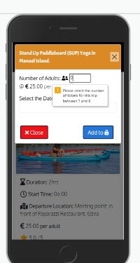
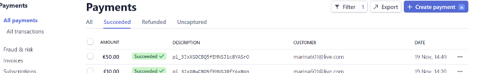
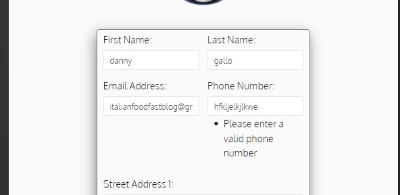
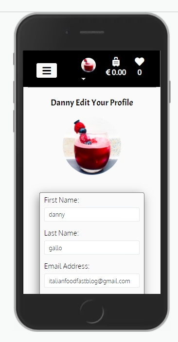
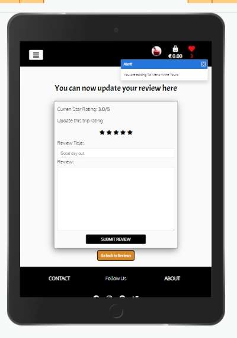
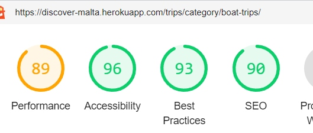

# Discover Malta - Testing details

[Main README.md file](README.md)

[View deployed site here](https://discover-malta.herokuapp.com/)

# Table of Content

[**Testing**](#testing)
   - [**Validation Results**](#validation-results)
   - [**Testing User Stories**](#user-stories-testing)
        - [**First Time User**](#first-time-user)
        - [**Returning User**](#returning-user)
        - [**Frequent User**](#frequent-user)
        - [**Potential Client**](#potential-client)
        - [**Business Goals**](#business-goals)
   -[**Automated Testing**](#automated-testing)
   - [**Manual Testing**](#manual-testing)
      - [**Device Compatibility Table**](#device-compatibility-table)
      - [**Elements on Every Page**](#elements-on-every-page)
      - [**Home Page**](#home-page)
      - [**All Trips**](#all-trips)
      - [**Trip Details**](#trip-details)
      - [**Bag**](#bag)
      - [**Checkout**](#checkout)
      - [**Checkout Complete**](#checkout-complete)
      - [**About Page**](#about-page)
      - [**Contact Page**](#contact-page) 
      - [**Registration Page**](#registration-page)
      - [**Login**](#login)
      - [**Forgot Password**](#forgot-password)
      - [**Reset Password**](#reset-password)  
      - [**Profile**](#profile)
      - [**Edit Profile**](#edit-profile)
      - [**Favourites**](#favourites)
      - [**View Review**](#view-review)
      - [**Edit Review**](#edit-review)
      - [**Add Trip**](#add-trip)
      - [**Update Trip**](#update-trip) 
      - [**404 Page**](#404-page)
      - [**500 Page**](#500-page)
   - [**Google Lighthouse Testing**](#google-lighthouse-testing)
   - [**Cross Browser Compatibility Table**](#cross-browser-compatibility-table)
   - [**Bugs**](#bugs)

## Validation Results

- The W3C Markup Validator and W3C CSS Validator Services were used to validate every page of the project to ensure there were no syntax errors in the project.
- I have also used JSHints for JavaScript and jQuery code.
- PEP8 has been used to ensure Python code is fully compliant.

- [W3C CSS validation](https://jigsaw.w3.org/css-validator/)

   | Files    |       Validation      |  Errors        |
   |----------|:---------------------:|:---------------:|
   |*checkout.css*|      &check; | removed `-webkit-transition` which was throwing a warning during validation |
   |*home.css* |      &check; | removed `-moz-transition` and `-webkit-transition` which was throwing a warning during validation|
   |*star-rating.css*  |      &check; | no errors |
   |*trips.css* |  &check; | removed `-moz-transition` and `-webkit-transition` which was throwing a warning during validation and dublicate background colour property |

 - Final check has been completed for all pages, no errors or warnings have been found.

- [W3C Markup Validation](https://validator.w3.org/)
   - HTML code pass validation without major errors.
   - Label element had `for` attribute invalid due to using form input elements from Django Forms, checked using the dev tools to find the correct `id` for the input element. Altered the `label` element to match the input `id`.

       | Pages    |       Validation      |
       |----------|:---------------------:|
       |*edit_profile.html*|      &check; |
       |*edit_review.html* |      &check; |
       |*favourites.html*  |      &check; |
       |*forgot_password.html* |  &check; |
       |*login.html* |            &check; |
       |*profile.html* |          &check; |
       |*regiseter.html* |         &check;|
       |*reset_password.html* |   &check; |
       |*view_reviews.html* |     &check; |
       |*bag.html* |              &check; |
       |*checkout_complete.html* | &check;|
       |*checkout.html* |          &check;|
       |*about.html* |             &check;|
       |*contact.html* |           &check;|
       |*index.html* |             &check;|
       |*add_trip.html* |          &check;|
       |*trip_detail.html* |       &check;|
       |*trips.html* |             &check;|
       |*update_trip.html* |       &check;|

  - Final check has been completed for all pages, no errors or warnings have been found.

- [Broken link check](https://www.brokenlinkcheck.com/broken-links.php#status)
   - All pages have passed without issues, no broken links have been detected
  

- [JSHint](https://jshint.com/)
   
   | Files    |       Validation      |  Errors        |
   |----------|:---------------------:|:---------------:|
   |*quantity.js*|      &check; | removed bad assignment `$(input).val() = 8` due to bad assignment warning |
   |*stripe.js* |      &check; | one undefined variable `Stripe` which is coming directly from *Stripe API* |
   |*home-script.js*  |      &check; | no errors |
   |*dateoucjer.js* |  &check; | no errors |
   |*main_script.js* |  &check; | one undefined variable `bootstrap` coming from Bootstrap library |
   |*modal.js* |   &check; |  no errors |

 - Final check has been completed for all pages, no errors or warnings have been found.

- [PEP8](http://pep8online.com/)
   
   | Apps    |       Validation      |  Errors        |
   |----------|:---------------------:|:---------------:|
   |*Accounts*|      &check; | forms.py - white space on line 21 |
   |*Bag* |      &check; | vies.py - line 124 indentation error |
   |*Checkout*  |      &check; | no errors  |
   |*Contact* |  &check; | no errors|
   |*Discover_Malta* |  &check; | settings.py - lines 123, 126, 129, 132 displayed an error of being too long, this was left unfirxed as they were provided by default by Django|
   |*Home* |   &check; |  no errrors |
   |*Trips* |   &check; | no errors  |
   |*custom_storages.py* |   &check; | no errors  |

- [Extendclass](https://extendsclass.com/python-tester.html)

   | Apps    |       Validation      |  Errors        |
   |----------|:---------------------:|:---------------:|
   |*Accounts*|      &check; | forms.py and views.py throwing a syntax error for `f string` |
   |*Bag* |      &check; | views.py - throwing a syntax error for `f string` |
   |*Checkout*  |      &check; | forms.py, models.py, views.py, webhook_handler.py throwing a syntax error for `f string` |
   |*Contact* |  &check; | views.py - throwing a syntax error for `f string` |
   |*Discover_Malta* |  &check; | settings.py - throwing a syntax error for `f string`|
   |*Home* |   &check; | no errors   |
   |*Trips* |   &check; | views.py - throwing a syntax error for `f string`  |
   |*custom_storages.py* |   &check; | no errors  |

##### back to [content](#table-of-content)

## User stories testing

### Testing user stories from UX section of [README.md](README.md)

#### First Time User

1.	As a first time user, I want to understand what this site is about.

  - The site is designed with simple and easy to understand content in mind.
  - The title of the site tells the user this site is about Malta.
  - A hero images feature some of Malta's most iconic places
  - A favicon icon is a symbol of the sunny holiday platform

2.	As a first time user, I want to browse through the trips available on site.
  
  - The user can access all the trips via a link in the main navigation
  - The user may access trips that are specific to the category by clicking on the title of the category displayed on the Home page
  - The user may also access all trips via a call to action button at the bottom of the Home page

3.	As a first-time user, I want to see full trip details and trip reviews from other users.

   - When the user lands on the *trips.html* page they can view a short description of each trip, this also includes 
     - Trip Image
     - Trip Name
     - Trip Duration
     - Trip Price
     - Trip Star Rating
     - Call to action button 'More Info'

    - Based on this information a user may choose a specific trip that they want to view
    - They can access trip details in three ways:
      - By clicking on the trip image
      - By clicking on the trip name
      - By clicking on the 'More Info' button
    
    - The user will be directed to the *trip_details* page, where the user may view all the information for this trip
    - If the trip has star rating or reviews, they will be displayed to the user at the bottom of the page
    - The user will see the star rating, who created this review and the date the review has been created or updated.

4.  As a first-time user, I want to understand the benefits of booking my holiday itinerary using this platform.

    - On the *Home Page* the user is presented with a paragraph detailing why they should use this platform to plan their itinerary.
    - The benefits are presented in a visually enticing way, using different colour circles which display on scroll, drawing the user attention
    - The circles use icons and text to give the user a full experience.

5.  As a first-time user, I want to add the trips which I like to my favourites.

    - A user may shortlist trips to their favourites in two ways: 
       - From *trips.html* page
       - From *trip_details page*
    - By clicking on the heart shape icon
    - If the user is not logged in, and they hover over the icon, the message will be displayed telling them they should log in to add this trip to their favourites.
    - If they click on the icon, they will be redirected to the *login page*, where they can choose to log in or register
    - Once the user is logged-in, they may add trips to their favourite list by clicking on the heart icon.
    - A message will be displayed at the top of the screen letting them which trip they have added to their favourite list 
    - Hear icon in the menu will change colour to red and the trip count will be amended letting the user know how many trips they have added to their favourites.

6.  As a first-time user, I want to find a variety of experiences suited for different ages and requirements.

    - User may choose to search for a specific keyword in the search bar provided on *trips.html* at the top of the page.
    - The search bar will display the number of the results found with their keyword and all the related trips
    - The user may narrow down their search by clicking on the specific category, the dropdown menu is available in the navbar across the whole site
    - On the *trips.html* under "Refine you search", they have an option to choose their category as well
    - The user may sort the trips available by price, rating, duration or whether or not the trip is family-friendly on the *trips.html*

7.  As a first-time user, I want to navigate the site easily and view the site on different screen sizes.

    - The site has been designed with user experience and a mobile-first approach in mind. The site has adopted a fully responsive design across all screen sizes.

##### back to [content](#table-of-content)

#### Returning User 

1.	As a returning user, I want to be able to login into my account

    - Once the user is registered and has gone through verification steps, the user may log in to their account by pressing on the user icon in the navigation bar.
    - A dropdown menu will open and give 2 options to the user, either to log in or register.
    - Once the user is logged in, they will be greeted with a friendly message welcoming them to the site, using their name
    - The user icon will change into the default user avatar or custom if selected.

2.	As a returning time user, I want to view my favourites and check their availability

    - A logged-in user may access their favourites by clicking on the heart icon in the navigation bar
    - The icon will display the number of trips the user has in their favourites list
    - A logged-in user may navigate to their profile page and click on the link "View Favourites", to access their favourites page
    - On this page, the user can see how many favourites they have in their list, by clicking on the trip image, name or "More Info" button they will be directed to the *trip details* page.
    - They may add a trip to their shopping bag by clicking on the "Book Now" button and selecting the number of tickets and booking date.
    - If the trip does not have enough tickets for the user requirements, the message will display letting the user know how many tickets are left for a specific trip.
    - If the trip does not have any tickets left, the "Book Now" button will display "Sold Out" and the button will be disabled.

3.	As a returning user, I want to search for a specific trip or filter trips by category.

     - By now the user is familiar with the site and will be able to navigate easily throughout it.
     - Can view the trips by category from the *Home page*, *navigation menu* or *trips.html*
     - They can sort the trips from the *trips.html* using the *Sort By* dropdown menu

4.	As a returning user, I want to learn more about the site.

    - A user may find a link to the about page in the footer.
    - The link will take them to the *About Page*, where the user can find out the core mission behind the site
    - A user has two options at the bottom of the page to "Go Back" which will take the user to the *Home Page* or to *Get in Touch* which will take the user to the contact page.

5.	As a returning user, I want to purchase the trip with secure checkout.

    - A user may access the checkout from their shopping bag page, the link "Proceed to Secure Checkout" is located at the bottom of the page
    - Once the user is on the checkout page, they are presented with short information about the trip they are about to purchase
    - They have an option to view full details of the trip by clicking on *trip name*
    - The user is asked to fill in the form with their details
    - A user navigates to *login page* or *registration page* if they would like to save their details for next time and view their order history.
    - If the user is logged in, the form will be pre-filled with user details stored in a user profile
    - The user may click a box to save or update their personal information during the checkout process
    - Once the user enters a card number, Stripe will act as a secure payment platform and check that all required details are correct.
    - On successful checkout, the user will be redirected to the *complete checkout* view, where the ticket summary will be displayed.
    - A message at the top of the screen will let the user know that a confirmation email has been sent to their email address.
    - The user will receive a confirmation email that will display their order number, which they will need to present to the trip provider on the day of the trip
    - A logged-in user may also view their order history on their profile page.
    - User card details are not stored in the database.

6.	As a returning user, I want to get an instant email confirmation of my transaction.
    
    - During successful checkout, the user will receive a confirmation email which will display their order number
    - They will need to present their order number to the trip provider on the day of the trip
    - This email will contain full details of the trips booked and personal details entered.

7.	As a returning user, I want to have feedback provided to me every step of the way.

    - The site is designed to provide and guide the user during their time on the site.
    - The feedback is provided to the user in the form of notifications, which appear at the top of the page.
    - Warnings, Alerts, Info and Success messages
    - When the user is deleting their review, a modal will appear asking to confirm their decision.
    - Automated emails have been set up as a confirmation to the user of their actions during purchase, registration, resetting password and contacting the site owners.

8.	As a returning user, I want to view my ticket on my profile page.

    - If the user has registered on the site, before purchasing, their order history will be displayed on their profile page

9.  As a returning user, I want to be able to save my information to my profile for quick and easy checkout next time.
    
    - This functionality is restricted to registered and logged in users.
    - The user can click on the checkbox during the checkout process to save or update their personal information
    - The user will be able to view this information in their profile
    - - The user will have their saved information pre-populated next time they use a checkout form or a contact form.

##### back to [content](#table-of-content)

#### Frequent User

1.	As a frequent user, I want to customize my profile page

    - A logged-in user may navigate to their profile page.
    - Profile page displays several options available to the user 
    - By clicking on the link "Edit Your Profile" the user will be re-directed to the page where they can view and update their personal information, including their avatar.

2.	As a frequent user, I want to review the trips which I have been on.

    - A logged-in user, who has purchased a specific trip may navigate to the trip detail page where a review form will be available to them
    - They may choose to give star-rating, review title and their review of their experience
    - The form will be submitted and they will be able to view their review straight away on the same page
    - If the user has not purchased the trip yet, a message will be displayed to them notifying them they have to purchase the trip first

3.	As a frequent user, I want to be able to update and delete my reviews.

    - If the user is logged-in and has reviews, they can edit or delete their reviews from:
       - *Trip Detail Page* by clicking on the appropriate buttons
       - If the user submits another review for the same trip, their original review will be updated
       - *Profile Page* - click on the link "Manage Reviews" which will take the user to the *view_review.html* page. All the user reviews are displayed on this page
        - A user may choose to "Edit" their review which will take the user to a pre-filled form with their review and an alert will appear letting the user know which review they are editing.
       - User may choose to "Delete" their review, in that case, a modal will appear asking the user to confirm their decision. 

4.	As a frequent user, I want to follow the site on social media.

       - The user may click on the social media icons at the bottom of the page which will take them to their prefered site.

5.	As a frequent user, I want to be able to contact the site owners if I have an enquire.
       
        - Any user may click on the contact link located in the footer of the site.
        - It will take them to the *contact.html*, if the user is logged in they will have their information pre-filled for a quicker form submission
        - Otherwise, the user will be asked to fill in the form and choose a subject from the dropdown menu
        - The user is redirected to the *home page* and a message will appear on the screen letting them know they should have received a confirmation email
        - A user will receive an automated email letting them know the site owners have received their enquire and will be in touch shortly.
        - An email will be generated to the admin user, with client enquiries and client details.

6.  As a frequent user, I want to the explore latest deals
        
        - Last minute deals category is positioned in the category dropdown menu, if there are any trips under this category the user will be able to view a list of trips by clicking on this category link.

##### back to [content](#table-of-content)

### Potential Client
1.	As a potential client I want to see a sample of trips to get an overview of what my product might look like

     - A potential client may browse through the site to get the feel of the design and style of the site
     - Each trip has the same style and design, therefore a potential client may have a good overview of what their product may 
     look like on the site

2.	As a potential client I want to learn what benefits are available to me
    
    - A potential client may navigate to *About Page*
    - The information presented here is to let the user know about the core mission of the site and what benefits are available to the potential clients
    - Call to action button, prompts the potential client to get in touch and request more information.

3.	As a potential client I want to easily get in touch with the site owners to request further information or book a call

    - A potential client may get in touch with the site owners by completing a contact form 
    - A subject option "Collaboration" has been created especially for this in mind. 
    - Once the message is  received a relevant person from the team will be in touch

##### back to [content](#table-of-content)

### Business goals

1.	As a business owner, I want to provide a platform for users where they explore what Malta has to offer and book their trips during their stay on the island.

    - The site has been designed to showcase what Malta has to offer
    - Provide the user with the range of activities
    - Enable the user to easily narrow down their search specific to their requirements

2.	As a business owner, I want the user to be able to register with secure login details.

    - Discover Malta has been designed to simplify the registration process for the user and ensure the user details are stored securely.
    - For the user to register they have to provide their full name, telephone number, email address and password.
    - A secure link is generated and sent to the user upon their registration
    - Once the link is clicked from the user email address the user is activated
    - User details and hashed password is stored in the database.
    - User can reset their password by clicking on the `click here to reset your password` link 
    - In that case, another email is generated and sent to the user email address to create a new password
    - The user can log in when two conditions are met, user email address and password
    - The site owner who will have access to the database, will be able to see the username, however, will not be able to see the user password which is stored securely.
    - The user may choose to update their details on their profile page by clicking on the link `edit your profile`
 
3.	As a business owner, I want the user to be able to use the site easily on any device.

     - The site has been designed to be fully responsive with the mobile-first approach in mind.

4.	As a business owner, I want to provide useful links to users where they can purchase products and earn an affiliate commission.

     - The shop feature is yet to be implemented
     - The site owner will be able to earn commission on the sale of the tickets, once terms and conditions have been agreed upon with the provider.

5.	As a business owner, I want to be able to delete any reviews which I consider to be inappropriate or out of content.

     - An admin user may set any review status to False inside their Django admin panel. 
     - The condition for review to display on site has been set as default to True.

6.	As a business owner, I want to be able to add additional new trips to the site. 

     - An admin user, once logged in, can navigate to their profile page, where they will see a link to the *add trip* page.
     - Once on the page, the admin user can add a new trip to the database once all the conditions have been met.
     - Once added a new trip, the admin user will be redirected to the *trip_detail* page where they will be able to view the trip which they have just created.

7.  As a business owner, I want to be able to edit or delete trips.

    - An admin user may delete or update each trip from 2 pages:
        - Trips.html
        - Trip Details page
    
    - Once the *Update* button has been pressed the user will be redirected to the `update_trip.html` page.
    - Alert will tell the user which trip they are updating.
    - Once the trip has been amended and form requirements are satisfied, the updated information will be saved to the database.
    - The user will be redirected to the *trip details* page.
    - Alert will be displayed letting the user know the information has been saved.

    - Once the *Delete* button has been pressed, an alert in the form of a modal will appear asking the user to confirm their decision.
    - If this is an intentional action, the trip will be deleted from the database.
 
8.  As a business owner, I want to provide the user with search and filter functionality for products to enable easy access to the database.
     
     - Users may search the site using a search bar
     - Users may filter the trips by category
     - Users may sort the trips by a condition

##### back to [content](#table-of-content)

## Automated Testing

- Due to the lack of time and the deadline approching, I did not manage to comple a full project unit testing. I have focused heavily on full manual testing to ensure every test case was tried and tested.

- Nevertheless, I have chosen a Trip and Contact app where I have performed partial automated unit testing in Python. 

- In order to run the report and view my unit testing coverage, I have installed `coverage` with `pip3 install coverage`
      1. Inside the terminal `coverage run --source={app_name} manage.py test`
      2. `coverage report`
      3. `coverage html`
      4. `python3 -m http.server`
- Now by clicking on the coverage file, you may view the percentage of code which has been tested.

- Inside the Contac App I have tested the view which return the correct template.

- Inside the Trip All, I have tested Category and Trip Modal, forms.py and some of the main features of the views.py file. 

- I am looking forward to learning more about unit testing, and perform full automated testing in my next application.

##### back to [content](#table-of-content)

## Manual Testing

### Device compatibility table

| Pages    |<strong>Laptop</strong>|<strong>Ipad</strong>|<strong>IphoneX</strong> | <strong>Nokia2.4</strong> | <strong>Sumsung</strong> |
|----------|:---------------------:|--------------------:|------------------------:|-----------------------:|-----------------------:|
| Home     | &check; | &check;| &check;| &check;| &check;|
| Trips  | &check; | &check;| &check;| &check;| &check;|   
| Trip Details    | &check; | &check;| &check;| &check;| &check;|
| Add Trip | &check; | &check;| &check;| &check;| &check;|
| Update Trip | &check; | &check;| &check;| &check;| &check;|
| About | &check; | &check;| &check;| &check;| &check;|
| Contact | &check; | &check;| &check;| &check;| &check;|
| Checkout Complete | &check; | &check;| &check;| &check;| &check;|
| Checkout | &check; | &check;| &check;| &check;| &check;|
| Bag | &check; | &check;| &check;| &check;| &check;|
| Edit Profile | &check; | &check;| &check;| &check;| &check;|
| Edit Review | &check; | &check;| &check;| &check;| &check;|
| Favourites | &check; | &check;| &check;| &check;| &check;|
| Forgot Password | &check; | &check;| &check;| &check;| &check;|
| Login | &check; | &check;| &check;| &check;| &check;|
| Profile | &check; | &check;| &check;| &check;| &check;|
| Register | &check; | &check;| &check;| &check;| &check;|
| Reset Password | &check; | &check;| &check;| &check;| &check;|
| View Reviews | &check; | &check;| &check;| &check;| &check;|
| 400.html | &check; | &check;| &check;| &check;| &check;|
    
##### back to [content](#table-of-content)

### Elements on Every Page

- All steps on the desktop were repeated on mobile, tablet and laptop screen sizes.

1. Navigation

- Hover over each link, confirm the hover effect works as expected.
- Click each link in the navbar to confirm that it leads to the correct page.
- Click each link in the "Categories" dropdown menu and confirm each category displays the correct trips.
- Confirm that when logged out the options "Login" and "Register" are visible and that "Profile" and "Logout" are not.
- Click on the heart icon and confirm it takes the user to the "Login" page.
- Add a trip to your shopping bag, confirm the suitcase icon changes colour and the total value of the trips is updated.
- Remove all the trips from your shopping bag, confirm the icon changes colour to white and the value displayed is 0.00.

- Log in to the site, confirm that options "Profile" and "Logout" are visible and that "Login" and "Register" are not.
        - Confirm the user icon changes either to the default user image or the selected user image is changed by the user.
        - Add some trips to your favourites and confirm the heart icon changes colour and displays the number of trips added.
        - Click on the favourites link and confirm it takes the user to the "Favourites Page".
        - Remove all the trips from your favourite list and confirm the heart icon changes the colour back to white and displays 0 number of trips in your favourite

- Go to the bottom of the page to make sure the navigation bar is sticky.

- Mobile and Tablet view:

  - Confirm burger button appears on the left-hand side of the navbar.
  - Confirm the user, suitcase and heart icons appear next to the burger button.
  - Click on the burger button, confirm the background colour and the colour of the bars are changing.
  - Click on the burger button, confirm the drop-down menu display links: "Home", "All Trips" and "Categories"
  - Click on the "Categories" dropdown menu and confirm all the category links are displayed.
  - Confirm the site heading/logo "Discover Malta" is no longer visible.
  - Followed the same steps as above to determine all the links are working.
  - Flip the tablet and mobile devices to check responsiveness.

2. Footer
  - Hovered over each link, confirmed background colour changed as expected.
  - Confirm "Follow Us" is disabled, therefore no animation is present on hover.
  - Click all links in the footer, confirm that they take the user to the relevant pages within the site.
  - Click the social icons, confirm that they open a new tab and take the user to the correct social media platform.
  - The footer is responsive on all window view sizes.
  - Check the date of copyright information, confirm the year displayed matches the current year.

3. Favicon
  - View the site on different devices and confirm the favicon image is present.

4. Title
  - Click on each page, view the tap of each page and confirm each page contains a custom title.

##### back to [content](#table-of-content)

### Home Page

1. Hero Slider
   - Confirm the carousel images fade within 5 seconds
   - Confirm the carousel is touch compatible by sliding the fingers to the left and right
   - Open dev tools in Google Chrome confirm each image contains `alt` attribute

2. Welcome Message 
   - View the welcome message on all devices, confirm the message appears in the centre of the page.

3. Benefits
   - Scroll up and confirm no benefits are displayed on the page
   - Confirm each element is displayed to the user within 2 seconds interval
   - Confirm responsive layout of the elements across all screen sizes
   - Confirm each element contains `box-shadow: -3px 8px 27px -2px rgb(180 179 179 / 51%);` which makes them stand out.
   - Inspect the page in the Google Dev Tools and confirm each icon contains the `aria-hidden="True"` attribute. This will make the icon hidden from the screen reader, giving the user better accessibility to the page.

4. Categories 
   - Confirm the categories divs are displayed in the grid format and responsive across all screen views:
            - Large screen - 4 category cards per row
            - Medium screen - 3 category cards per row
            - Small screen - 1 category card per row
   - Each category card contains a border and box-shadow property to make them stand out and create a 3D look
   - Hover over each card and confirm the `box-shadow` property is changing
   - Hover over each title of the category and confirm background colour is changing as expected
   - Click on each category title and confirm it takes you to the page which displays trips only under a specific category. The trip count displays the correct number of results returned.
   - Click on the 'last minute deals' category and confirm the no trips are displayed, the trip count is showing 0 and a message is displayed to the user. 

5. Call to Action 
  - View all trips call to action button appears at the bottom of the page.
  - Hover over the link, confirm background colour is changing as expected.
  - Click on the link, confirm it takes the user to the *trips.html* page.

  - Above tests have been repeated on tablet and mobile devices.

##### back to [content](#table-of-content)   

### All Trips

1. Search

  - Click inside the search input and confirm the placeholder displays the text "Search our site"
  - Search by a keyword, confirm the page displays all the trips which contain the keyword and the number of results is updated.
  - Type a keyword that does not exist like "kitty" and confirm no trips are displayed, the result count displays 0 and a message is displayed to the user telling them "We do not have any trips with your search criteria, please try again."
  - Click on the search button with an empty input field and confirm all trips are displayed again.

2. Filter

  - Click on the dropdown menu "Categories" and confirm all the categories are displayed which exists in the database, plus a link to all trips is also present.
  - Hover over each link and confirm the background colour is changing and transitions are present, as expected.
  - Click on each link and confirm the page displays the trips under each category, the total trip count updates and represents the number of trips under each category.
  - Click on the "All trips" link and confirm all the trips are displayed on the page.

3. Sort
   - Select sort by price and sort by duration confirm the results are returned in ascending order.
   - Select sort by rating, confirm the results returned are in descending order
   - Select sort by family-friendly, confirm the results returned to display the trips which have value `family_friendly` set to `True`
   - Confirm each time the sort functionality is selected the total number of trips is returned in the `trip_count`

- Hover over the search, choose your category and sort by buttons and confirm the background colour is changing.

4. Trip-card

   - Confirm the cards are displayed 3 in the row on the large screen, 2 in the row on the medium screen and a single card in each row on the small screen.
   - Hover over each card and confirm the box-shadow property is changing, making each card-trip stand out to the user
   - Hover over the heart icon, confirm the background colour changes as expected. 
   - For not logged in user:
            - Tooltip displays the message "Login to add this trip to your favourites".
            - Click on the heart icon, confirm that it redirects the user to the login page.
   - If the user is logged in:
            - Hover over the heart icon, a tooltip displays the message "Add to favourites"
            - Click on the icon, confirm the icon disappears and instead the trash icon appears.
            - Hover over the trash icon, a tooltip displays the message "Remove from favourites".
            - Heart icon in the navbar changes colour to red and displays the number of trips added to the favourite list.
            - Toast message notifies the user which trip they have added to their favourites
            - Click on the trash icon, confirm the number of trips in the navbar updates
            - If no trips in the favourite list the heart icon displays 0 and the background colour goes back to the default white.
            - The trip's heart icon which has been removed from the favourites list reverts to its original state.
            - Toast message notifies the user which trip they have removed from their favourites

   

   - Hover over the trip image, confirm the `cursor` is set to `pointer`.
   - Click on the trip image, confirm it takes the user to the "Trip Details Page".
   - Hover over the trip name, confirm the background and text colour changes as expected.
   - Click on the trip name, confirm it takes the user to the "Trip Detail Page".
   -- Trip card contains a short description of the trip, if the text length is longer than the height property set to the card, it displays the `overflow: auto;` property set in the CSS file.
   - 4 icons at the middle of the card set out the most important information the user might look out for:
            - Duration
            - Price
            - Rating
            - Family Friendly
    - If the trip has a star rating, the star icon changes colour to yellow and display the average star rating for the trip calculated in the trips.models.py using the Avg function from Django:

              - `def averageRating(self):
              -      """Calculate average trip review"""
              -      reviews = ReviewRating.objects.filter(trip=self,
              -                                           status=True).aggregate(
              -                                               average=Avg('rating'))
              -     avg = 0
              -      if reviews['average'] is not None:
              -          avg = float(reviews['average'])
              -     return avg`
    - If there is no star rating for this trip, the star icon is set to default black colour and the message displays there is "no rating yet"
    - If the trip is family-friendly a child icon is displayed, if the trip is not set to be family-friendly no icon is displayed.
    - Call to action button "More Info", on hover changes colour and when clicked directs the user to trip details page.
    - Open dev tools in Google Chrome and inspect each card image, confirm each image contains an `alt` attribute

6. Admin User
   - If the user is logged in as an Admin user, they have 2 extra buttons at the bottom of each card.
           -Update
           -Delete
  - Click on the update button, confirm it redirects the user to the "Update Trip Page" for the current trip.
  - Try to access the update_trip URL as a non logged in user, confirm it redirects the user to the login page.
  - Try to access the update_trip URL as a logged-in user, confirm the message is displayed telling the user they do not have access to this page and the link is in the form of a button is displayed "Go back to all Trips"
  - Click on the delete button, confirm a modal is displayed asking the user to confirm their decision.
  - Click the delete button in the modal, confirm the toast message appears telling the user which trip has been deleted and redirects the user back to *trips.html*
  - Try to access the delete_trip URL as a non logged in user, confirm it redirects the user to the login page.
  - Try to access delete_trip URL as a logged-in user, confirm toast notification appears letting the user know they do not have admin privileges to delete this trip
  - Confirm the Update and Delete buttons only visible to Admin user

7. Pagination
  - Go to the bottom of the page and check the pagination is working as expected
  - 8 Trips per page will display on the first page
  - Then the number of pages will be dynamically generated based on `trip_count` results
  - If on page 1, the Previous button will be disabled 
  - If on the last page, the Next button will be disabled.
  - Current page number is displayed to the user and the page number's background colour is changed when active.

##### back to [content](#table-of-content)

## Trip Details

1. Favourites
  -  Confirm favourites functionality works in the same way as described in "All Trips Page".

2. Book Now
   - Book Now button appears in the top right-hand corner.
   - Scroll down and confirm the button is fixed to the top of the page at all times, giving the user easy access to add this trip to their bag and check availability
   - If the trip's number of tickets is 0, confirm the "Sold Out" is displayed instead, which is not fixed to the top of the page
   - Confirm the button is disabled and the user is not able to click on it
   - Click on the "Book Now" button to confirm modal is appearing asking the user to enter the number of tickets and booking date
   - Confirm if the trip is not family_friendly, the modal displays an input field only for adult tickets
   - Click on the "Add to Suitcase" button without entering any details, confirm the message is displayed "Please select the number of tickets for this trip between 1-8"
   - Try to type a letter in the input field, confirm nothing is displayed, the input field expects a number.
   - Enter an adult number of tickets and click on the "Add to Suitcase" button, confirm the message displayed "Select the date for your trip"
   - Type a number greater than 8 into the `children_tickets` input field, confirm a validation message displays "Maximum number of tickets can be selected is 8"
   - Select the correct number of children tickets, 0 adult tickets and valid date. Confirm the validation message appears again to get the number of adult tickets.

   

   3. Datepicker

            - Click on the input field to select the date, confirm datepicker is displayed.
            - Confirm the first available date is available is tomorrow, the user will not be able to book a trip for the current or past date.
            - Confirm tomorrow's date is highlighted.
            - Click on any disabled dates, confirm they cannot be selected.
            - Click on the Next button, next to the current month, confirm the month is changing, the current year is displayed.
            - Select any date in the future and confirm the datepicker is closing once the date is selected, the date selected is displayed inside the input field.
            - Open the datepicker again, confirm the datepicker highlights the date selected.
            - Try to modify the date in the input field to past date, confirm the alert message is displayed telling the user they need to pick a date in the future and input field set to the first available date(tomorrow).
    
    - Add the trip to the bag with children tickets set to 0, confirm the operation did display any errors, as the children tickets are allowed not to be selected
    - Once all the input fields are valid. Click "Add to suitcase" to confirm the toast notification is displayed telling the user which trip they have added to their bag.
    - Every time the user is adding tickets to their bag, the total number of tickets is adjusted in the database.
    - If the user selected more tickets than the number available in the database. The database will not be updated, the items will not be added to the bag, instead, a toast notification will appear telling the user how many tickets are left in the database.
    - If there are no tickets left in the database, the "Book Now" button will be replaced with "Sold Out". The button is disabled preventing the user from clicking on it.
   

   - Once the trip is added to the bag, confirm the suitcases in the navbar changes colour and displays the total amount in the bag
   - Add another trip to the bag to confirm the value in display updates
   - Select a trip that is already in the bag, add another ticket. 
      - The condition in Python checks: if the trip in the bag exists on the same date as selected again, also if there are enough tickets left for the trip. If all the conditions are met the bag gets updated, the total amount gets updated as well.
      - In case of an error relevant toast messages notify the user of the error.

 | 

4. Trip Details
   - Hover over a trip image and confirm `alt` attribute is present
   - Check that all the information from the database is present
   - Check average rating logic is the same as described in the "All Trips Page"
   - If the trip has any reviews, the review count is displayed
   - If there are no reviews for the trip, the "No Reviews" message is displayed next to the icon.

4. Cancellation Policy
   - Check that the cancellation policy contains a link to the "Contact Page"
   - Click on the link, confirm it takes the user to the *contact.html*

5. Review Rating
   - A user may only add the review based on 2 conditions, if the user is logged in and if they purchased a trip
   - A not-logged in user navigating to the bottom of the page, will see a message displayed "Have you been on this trip? Please rate your experience" and a button that navigates the user to the login page.
   - Click on the button, confirm the user is being redirected to the login page
   - Once the user is logged in, navigation to any "Trip Detail" page will display a form where the user can submit their review
   - Press submit button without filling out the review form, confirm message is displayed asking them to rate the trip
   - Rate the trip and press the submit button again, confirm message is displayed asking the  user give a title to their review
   - Fill out all the required fields and press the submit button again, confirm the toast notification is displayed telling the user their review has been submitted.
   - Confirm the average rating and review fields are updated
   - Under the "Customer Reviews" title, the total number of reviews is displayed
   - The user is redirected to the same page, at the bottom they will see their review appearing on the page
   - The user may delete or edit their review by clicking on the appropriate buttons.
   - Click on the Edit button and confirm the user is being redirected to *Edit Review Page*
   - Click on the Delete button and confirm the modal appears asking the user to confirm their decision.
   - Review Title does not accept more than 50 characters
   - Review message does not accept more than 500 characters
   - If the user exceeds the character count the input fields will not accept any further characters.

   - If the user did not purchase the trip, however, fill out the review form anyway and submit the review.
   - Error toast message will appear letting the user know they must purchase the trip first.

6. Customer Reviews
    - If the trip has a review "Customer Reviews" can be seen at the bottom of the page
    - The total number of reviews also tells the user how many reviews are there for this trip
    - Each review is presented in the form of a card, laid out 3 in a row on the large screen, 2 in a row on the medium screen and 1 in the single row on the small screen.
    - Each review card contains a review title, star rating, user avatar, name of the user and date created or updated.
    - Review-card contain the same shadow property as all the other cards on the site.
    - Hover effect also works as expected, described in the previous section.
    - Look at the trip which has reviews, but not by the current user. Confirm there is no "Edit" or "Delete" button present in the review card
    - Admin user may disable reviews from the Django Admin panel, by setting the Active value to false.
  
   | 

7. Call to Action 
    - Click on the "Back to All Trips" button, confirm it takes the user to *trips.html*.

##### back to [content](#table-of-content)

## Bag

1. Trip Details
   
   - Add a few different trips to your bag, which consist of family-friendly trips and not
   - Click on the suitcase button in the navbar, confirm the user is being redirected to the *bag.html*, all the selected information is present
   - Confirm the layout of the page, each trip is displayed on a different row.
   - Trip Details consist of:
         - Trip Image - confirm the `alt` attribute is present
         - Trip Name - hover over the name, confirm the background colour changes and the link takes you to the trip detail page
         - Duration of the trip is displayed
         - Start Time
         - Departure Location

 | 

2. Tickets
    - Ticket information displays how many adult tickets and children tickets are selected for the trip
    - If the trip is not family-friendly, no children ticket information is displayed
    - Ticket information also displays how many tickets are selected all together

3. Price
    - Price information is calculated the total value of adult tickets and the total value of children tickets

4. Quantity
    - 2 input fields display the quantity of the tickets selected for each trip
    - +/- buttons let the user amend the quantity selected
    - Update the quantity to more than 8 tickets, confirm alert appears letting the user know "They cannot add more than 8 tickets for this trip"
    - The plus button fades out for 5 seconds
    - The value of the input is displaying the maximum number of tickets 8
    - If the minus button sets the value to less than 0
    - Alert displays a message "You need select at least 1 adult ticket selected for this trip"
    - If the value of the input is set to 0 and the Update button is pressed, the trip gets removed from the bag, even if there are children tickets present
    - Using the `-` button and try to set the input value to the negative value, confirm the `-` button fades out for 5 seconds. Letting the user adjust the quantity
    - If there are too many tickets selected and not enough availability in the database, toast notification lets the user know how many tickets are left for the current trip
    - The value of the input remains the same.
    - Try to modify the input field's number of tickets manually to more than 8, confirm alert appears letting the user know the largest number could be selected in 8, the input value is changed to 8.
    - If the trip is deleted from the bag, all the selected tickets go back to the database and become available
    - Click on the "Delete" button, confirm the modal appears asking the user to confirm their decision.
    - If the trips ticket numbers are successfully updated, confirm the price, number of tickets, subtotal and grand total updates as expected.

 | 

5. Datepicker
    - Update different trips dates, confirm all the datepickers can update and select different dates.
    - Confirm the datepicker works as expected, described in the steps above

6. Subtotal
    - Subtotal field automatically updates for each line item based on user actions

7. Grand Total
    - Grand Total field automatically updates at the bottom of the page and inside the navbar underneath the suitcase icon

8. Call to Action Buttons
    - Two buttons at the bottom of the page:
        - Keep Shopping 
        - Proceed to secure checkout
    - Hover over the buttons, confirm the background colour changes as expected
    - Click on each button, confirm  the "Keep Shopping" button takes the user to the *trips.html* and the "Checkout" button takes the user to the *checkout.html*

    - Checkout button on the mobile devices is positioned at the top of the page, has a `position: fixed;` property, this has been designed for a quick checkout option on mobile devices.

##### back to [content](#table-of-content)

## Checkout 

1. Summary
   - Add some trips to your bag and proceed to the checkout page.
   - Confirm order summary displays:
       - Trip Image
       - Trip Name - confirm if clicked it will redirect the user to the trip detail page
       - Number of Adult and Children tickets if applicable
       - Total price for adult tickets and children tickets are applicable
       - Trip booking date
       - Subtotal for each trip

 | 

2. Order Form
   - If the user is logged in, the form will be pre-filled with all the available user details
        - Try to amend some details and click on the save details checkbox, go to the profile page to confirm the updated information is saved in the user profile
        - Try to amend some details and un-check the save details checkbox, go to the profile page to confirm the information has not been updated
   - If the user is not logged in:
        - Confirm all the required fields contain placeholders and `*` next to them.
        - Try to submit a form without filling in any details, confirm it prompts the user to fill in a name
        - Fill in the name, surname and invalid email address, confirm the validation error is displayed, letting the user know what needs to be fixed.
        - Fill in all the required fields, confirm country field displays a drop-down menu will all the countries
        - Confirm save-info checkbox is not present, instead, a message is asking the user to log in or register to save their information for a quick checkout next time and to view their order history on their Profile Page.

 | 

3. Stripe
    - Complete the order form and press on submit button without filling out card details
    - Confirm the page refreshes and displays an error telling the user their card details were incorrect
    - Try to supply wrong card details, confirm an error is displayed
    - Wrong expiration date, confirm an error is displayed
    - A message at the bottom of the form is showing the user how much will their card be charged

4. Call to action buttons
    - 2 buttons are displayed at the bottom of the page:
        - "Adjust Your Order" - click on the button and confirm it takes the user to the *bag.html*
        - "Complete Order" - once clicked all the information will be sent to stripe, which will listen out for a webhook, the order will be created in the database and an email confirmation will be sent to the user.
        - While the site is waiting for the response from Stripe, the user will see a loading spinner that tells the user the information is being processed.
        - Login to the admin panel, confirm the order has been created, original bag info is present, stripe PID is saved.

        

        - Login to Stripe and confirm the webhook has been successful, all the information has been received

        

        - If the user has been logged in at the time of purchase, the user may see their order details on their profile page.

        

        - Confirm the bag has been cleared.

##### back to [content](#table-of-content)

## Checkout Complete

- Once the checkout process is completed, confirm the user is being redirected to  the "Checkout Complete Page"
- Toast notification lets the user know the confirmation email has been sent to the email address provided.

 | 

- The page displays order summary and user personal information 
- User receives an email with all the information needed including the ticket number for the trip.

- Button at the bottom of the page redirects the user to *trips.html*

##### back to [content](#table-of-content)

## About Page

- Open dev tools and hover each image to confirm the `alt` attribute is present
- Hover over the buttons at the bottom of the page, confirm the background colour changes as expected
- Click on the "Go Back" button, confirm it takes the user to the "Home Page"
- Click on the "Get in Touch" button, confirm it takes the user to the "Contact Page"
- Check the responsive layout of the page on the tablet and mobile view.

##### back to [content](#table-of-content)

## Contact Page

 - Go to the "Contact Page", the user will be presented with a contact form
 - If the user is logged-in, the user's full name and email address will be pre-filled.
 - Try to submit an empty form, confirm the form is asking for the full name
 - Fill in the name and press submit button, confirm the form is asking for an email address
 - Enter an invalid email address and press submit button, confirm the form is asking for a valid email address
 - Enter full name and a valid email address, press submit button, confirm a validation message asking the user to select a subject.
 - Users may choose to select a subject from the drop-down menu or write their own.
 - Select the subject, full name and email, click on submit button, confirm a custom validation message is displayed asking the user to enter at least 10 characters"
 - Once all the input fields have been correctly completed, click on the "Submit" button.
 - Confirm the user is being re-directed to the "Hope Page" and the toast notification tells the user somebody will be in touch soon.
 - At this instance, 2 emails are generated at the backend. 
 - One email is sent to the user telling them their message has been received.
 - The other email is sent to the admin user giving them all the information filled out in the "Contact Form"
 - Click on the "Go Back" button, confirm the user is being re-directed to the "Home Page".

##### back to [content](#table-of-content)

## Registration Page

  - Go to the Registration page, confirm the form is displayed correctly.
  - Placeholders are present for each input field and  * indicates all the required fields
  - Try to press register, without filling in the form. Confirm custom message appears to inform the user what field they should enter.
  - Try to enter the first name, but nothing else, confirm the custom message appears to tell the user which field needs to be entered next.
  - Try to enter an invalid email address, confirm the custom message tells the user what is missing.
  - Try to enter the email address which already exists and all other required information, confirm a message tells the user the account with this email address already exists. 
  - Confirm phone_number input accepts only numbers
  - Try to create a new account with all required information, but two passwords that do not match, confirm that the flash message appears informing the user that the passwords entered do not match.

  

   - Try to enter a matching password that is less than 8 characters long, confirm a custom validation message tells the user the parameters of the password length.
  - Create a new account with a new username and 2 passwords that match, confirm the user is beign redirected to `/accounts/login/?command=verification&email=' + email`.
   - Custom message appears on the page telling the user that a verification email has been sent. The user also has an option to log in if they already verified their registration.

  

  - At this instance a custom url is generated  using `urlsafe_base64_encode(force_bytes(user.pk))` and `default_token_generator.make_token(user)` which is inserted inside the `account_activation.html` template, which is sent out to the user.
  - Confirm the email has been received with an activation click.
  - Login to Admin panel, confirm the user has been created but is not activated yet.
  - Click on the activation link, confirm the user has been redirected to the Login Page and a toast notification appears, telling the user their account has been activated.
  - Login to Admin Panel to confirm.
  - Click on the UserProfile inside the Admin Panel and confirm the User Profile has been automatically generated upon registration.
   - Go back to the login page and confirm the user can log in with new login details.
  - Confirm toast  notification tells the user they are now logged in and redirects the user to the Home Page
  - Confirm the user icon changes to the default user avatar in the navigation.
  - Click on the user avatar, confirm dropdown menu displays links only to profile and logout.
  - Click on the Profile Page and confirm the Profile Page is personalized to the newly created user.

  

  - On the registration page,  click the login button, confirm that it takes the user to the login page.
  - Above steps have been repeated on mobile and tablet devices. No changes to this page layout across the different screen sizes.
  - When the account is being created I am also creating a username by: `username = email.split("@")[0] + last_name`, even though at this moment in time I am not using username variable for anything, Django expects it in their default User Model.
  - As a logged-in user, try to access the Login Page by modifying the URL, confirm the user has been redirected to their profile page and toast notification informs the user they are already registered.
 - After your account has been activated, try to click on the link again, confirm the user is being redirected to the profile page, error message telling them the activation link is invalid and alert message telling the user they have already registered.

 - I have modified the base Django User Model to allow the user to log in with their email address, as usernames get forgotten very often and not being able to login to the site because the user forgot their username is a poor user experience.

##### back to [content](#table-of-content)

## Login

- Go to the login page, confirm that the login form is displayed correctly.
- Try to submit the form without entering any details, confirm custom feedback is displayed, which tells the user to fill in the field with their email address.
- Enter the email address, but not the password, confirm custom feedback is displayed, telling the user to enter a valid password.
- Try to login with a username or password which does not exist in the database, confirm the toast notification is displayed letting the user know that some of the details entered are incorrect.
- Confirm that the logged-in user is redirected to their profile page.
- Log out, then try to log in the using correct username and password, confirm that this is successful.
- Confirm *Click here to reset your password* link takes the user to the "Forgot password Page".
- Confirm *Register* link takes the user to the register page.
- Above steps have been repeated on mobile and tablet devices. No changes to this page layout across the different screen sizes.
- Confirm the navbar has changed based on user access.
- As a logged-in user, try to access the Login Page by modifying the URL, confirm the user has been redirected to their profile page and toast notification informs the user they are already logged in.

##### back to [content](#table-of-content)

## Forgot Password

- From the "Login Page", click on the *reset your password link*, confirm it takes the user to the "Forgot Password Page."
- Confirm Forgot Password form is displayed correctly.

- Try to submit an empty form, confirm the message is displayed asking the user to fill in the required field.
- Try to submit the form with the email address which does not exist, confirm error message appears informing the user the email address entered does not exist.

- Submit a form with a valid email address, confirm the user is being redirected to the "Login Page" and toast notification informs the user the email with a password reset link has been sent.
- At this instance, an email is sent to the user with a link, that is generated in the same way as an activation link to register a new account.
- Click on the link sent, confirm the user is being redirected to the "Reset Password Page" and the toast notification tells the user they can now reset their password.

- Click on the register button, confirm it takes the user to the "Registration Page".

- Activate account and reset password verification works in the same way, first I use `try` and `except` block to determent that the user and toked generated match:
   - `uid = urlsafe_base64_decode(uidb64).decode()`
   - `user = Account._default_manager.get(pk=uid)`
- In case `except` case is executed, then the error message will appear to the user.

##### back to [content](#table-of-content)

## Reset Password

- Upon successful verification of the `uid` and `user`, the user is being redirected to the "Reset Password Page"
- Try to submit a form without entering any values, confirm a custom validation message is displayed
- Complete the first input field, but not the second, confirm validation message is displayed
- Enter a password that is less than 8 characters long, confirm validation message is displayed.
- Enter 2 passwords that are more than 8 characters long, but different, confirm validation message is displayed.
- Confirm, the user is being redirected to the login page and the toast notification display a success message.
- Login using your email address and the old password, confirm the login attempt has failed.
- Login with reset password and confirm the login attempt has been successful.

##### back to [content](#table-of-content)

## Profile

- Login into the site and navigate to the User Profile Page.
- Confirm a welcome message is displayed including the user's first name for authentication.
- User default avatar or custom avatar image is displayed in the middle of the page
- Confirm the user is presented with 4 options in the form of the button:
        - View Order History
        - Edit Your Profile
        - View Favourites
        - Manage Reviews

- If the user is `superadmin` an additional link -Add Trip is displayed, confirm this is not displayed for a regular user.
- View Order History is an anchor link that brings the user to the bottom of the page, where the order history is located in ascending order.
- Hover over the order number, confirm the background changes, as expected.
- Click on the order number, confirm the toast notification tells the user they are viewing past order and the date when the confirmation email has been sent.
- If the user does not have a order history yet, the massage will let the user know they have not placed any orders yet.
- Hover over each link and confirm the background colour changes as expected.
- Click on each link and confirm they all lead to the relevant page.
- Log out and try to modify the URL to go to the profile page, confirm the user is being re-directed to the "Login Page".

 | 

##### back to [content](#table-of-content)

## Edit Profile

- From the Profile Page click on "Edit Your Profile", confirm the page takes the user to the form which is pre-filled with user information.
- Edit Profile form consists of 2 forms, one is the `user_form` which takes all the information upon the registration and the other one is the `profile_form`.
- Delete all the information from the form and click the "Update My Profile" button, confirm toast error notification is displayed to the user and no information is updated.
- Confirm the placeholders display the information required for the form to be submitted
- Try to type incorrect email address, confirm validation message is displayed telling the user what is missing
- Try to type letters into the phone_number field and submit the form, confirm the form validation message tells the user to enter a valid phone number

- Try to update the profile picture, upload a non-image file, confirm the form validation has failed, the toast notification and form validation error is displayed to the user.

- Upload a media file and all the required information, click on submit button, confirm the toast notification is displaying a success message. The user is being redirected to the same page, where their updated information is displayed.
- User avatar has been updated on the page and in the navbar.
- If the email address is changed during this process, log out, then try to login with an old email address, confirm the authentication fails.
- Try to login with an updated email address, confirm the authentication is successful and toast notification informs the user they are logged in.  
- Click on the "Go back to Profile" and confirm the links takes the user to the profile page.
- Log out and modify the url to /accounts/edit_profile, confirm the user is redirected to the login page.

##### back to [content](#table-of-content)

## Favourites

- From the user Profile Page, click on the button "View Favourites", the user also may access this page by clicking on the heart icon in the navigation bar. Confirm both links redirect the user to the same page.
- Confirm the total number of favourites is equivalent to the number of favourite trips displayed on the page.
- The layout of the trips on the page is identical to *trips.html*
- Confirm the favourites functionality works in the same way as described in the All Trips
- Confirm the trip-card is functioning in the same way as described in the All Trips.
- Click on the "Go Back to Profile" button, confirm it takes the user to the "Profile Page"
- If the user does not have any trips added to their favourites, the message is displayed on the page telling the user they did not add any trips to their favourites yet, call to action button directs the user to the *trips.html*.
- Log out and modify the url to /accounts/favourites/, confirm the user is redirected to the login page.

 | 

##### back to [content](#table-of-content)

## View Reviews

- From the Profile Page, click the "Manage Reviews" link, confirm it takes the user to *view_reviews.html*.
- If the user does not have any reviews, a custom message is displayed on the page and the button "Go back to Profile".
- If the user has reviews, the reviews are displayed in the form of cards and contain the same layout as the described on the trip detail page, with an exception for trip name added to each review, to make it easier to identify.
- Confirm the review are displayed only the ones the current logged in user has created
- The user has 2 options to Delete or Edit the review
- If the user is pressing on the "Delete" button, confirm the modal appears asking the user to confirm their decision, the same logic is present as described on the "Trip Details" page.

- Click on the "Edit" button, confirm it takes the user to the *edit_review.html*
- Click on the "Back to Profile" button to confirm the user is being redirected to the "User Profile Page".
- Log out and modify the url to /accounts/view_reviews/, confirm the user is redirected to the login page.

##### back to [content](#table-of-content)

## Edit Review 

- Click on the "Edit" button from the "View Reviews" page or the "Trip Details" page
- Confirm user review is displayed correctly
- Toast notification tells the user which review they are updating
- Confirm the form is displayed correctly
- Confirm the form also lets the user know what is the current rating given to the review
- To update the review the user has to fill in the required fields (rating and review title)
- Delete the review title, click submit button, confirm the user is asked to fill in the rating and then the review title before the form is submitted.
- Once all the required fields are entered and the form is submitted, the user is being redirected to the "View Reviews" page.
- Toast notification lets the user know their review has been updated.
- Confirm the updated date is now updated and displayed on the review card.
- Log out and modify the url to /accounts/edit_review/25, confirm the user is redirected to the login page.

##### back to [content](#table-of-content)

## Add Trip

- This option is only available for admin users.
- Login to site with Admin Account and navigate to the Profile page, confirm the profile page displays an additional link which lets the user add a trip to the database.
- Confirm the add trip form is displayed as expected.
- Confirm custom placeholders are present, guiding the user through the form submission.
- Try to submit an empty form, confirm the form is not submitted and the user is being diverted to the trip name, where the placeholder tells the user what is they need to enter.
- Try to upload a text file instead of the media file to confirm the validation is present and the user is given feedback.
- There are two buttons at the bottom of the page, click on the "Cancel" button, confirm the user is being redirected to their Profile Page and the information entered is not saved.
- Once all the required fields in the form has been submitted, click the "Add Trip" button, confirm the user is being taken to the new *Trip Details Page*, where they can check the information they entered.
- Login to the Django Admin panel and confirm the new trip has been added to the database.
- Also the admin user can update or delete the current trip by clicking on the relevant links.
- Confirm the user can search the newly created trip.
- Confirm the user can purchase the trip and add a review.
- Click on the "Delete" button, confirm the delete functionality works as expected.
- Confirm all the related reviews are deleted from the database when the trip is deleted.
- Log out and modify the url to /trips/add_trip/, confirm the user is redirected to the login page.
- Login as not admin user, try to navigate to the same page by amending the url, confirm the message is displayed letting the user know they do not have permission to access this page.

##### back to [content](#table-of-content)

## Update Trip

- This page is only for Admin user, who can easily update trip using the website.
- Login with Admin details, from the trips page click the Update button on any trip card, confirm the correct information is displayed for a selected trip.
- Navigate to any trip details page and click the Update button, confirm the correct information is displayed.
- Try to delete any input field and submit the form, the user the form field displays a placeholder which lets the user know what information is missing, the form is not submitted and no changes are made in the database.
- Try to amend any value and submit the form, by pressing the Edit button, confirm the user is being redirected to the current trip details page as expected with feedback displayed to the user.
- All custom placeholders and form validations are identical to add trip page.
- Hover over the 2 buttons at the end of the form, confirm the background colour changes as expected.
- Cancel the button, the user is being redirected back to the trips page, no changes are made in the database.
- Repeated the following steps for tablet and mobile view. 
- Log out and modify the url to /trips/add_trip/, confirm the user is redirected to the login page.
- Login as not admin user, try to navigate to the same page by amending the url, confirm the message is displayed letting the user know they do not have permission to access this page.

##### back to [content](#table-of-content)

## Logout

- A logged-in user, may log out from their account at any time by simply clicking on their avatar at the top of the navbar
- Select the option logout from the dropdown menu and click the button
- Confirm the user is being redirected to the "Home Page" and the toast notification displays a success message to the user.

##### back to [content](#table-of-content)

## 404.html

- Starting at the desktop view, typed some random characters after the URL and custom 404 page is displayed.
- Hover over the button which leads to the home page and the colour has changed. 
- Clicked on the button and the link has diverted the user to the home page. 
- Repeated the following steps for tablet and mobile view. 
- The result was satisfactory across the different size devices and browsers.

##### back to [content](#table-of-content)

## 500.html

##### back to [content](#table-of-content)

- Custom server error page has been designed to provide feedback to the user
- The page is identical to 404.html and also provides the link for the user to return to the home page
- To test this page I had to take the following steps
  1. inside `urls.py`  import - `from django.views.generic import TemplateView`
  2. Add path - `path("500.html/", TemplateView.as_view(template_name="500.html"))`
  
  - I have used the above code to test my custom 500.html, then removed it upon successful testing.

 | 

## Google Lighthouse Testing

- To get an accurate report all the pages have been viewed using an incognito window.
## Home Page 

## Login Page

## About Page

## Profile Page

## All Trips

### Pagination

  - Pagination next and previous buttons did not have any screen reader accessibility
  - Added `next button`
  - The same issue was detected on the search icon
  - The button "More Info" does not have very descriptive text, I have decided not to fix this issue at this point

### Datepicker
  - Datepicker input field did not have any associated label, therefore I have added the label on the "Trip Detail" and the "Bag" pages.

### Modals 
  - The trigger button for all modals was using `<a>` element which resulted in the uncrawlable link, updated the element to a `button`

## Bag

### Labels
  - Input fields did not have assosiated labels, fixed by adding the labels.

## Trip Detail

## Checkout

## Checkout Complete

## View Reviews

- Magiority of performance issues is due to the image files being large, i have compressed all the images to reduce loading time using [TinyPing](https://tinypng.com/)

### Cross-Browser Compatibility Table 

| Pages    | **Google Chrome** | **Edge**  | **Safari**| **Firefox**
|----------|:-----------------:|-----------:|---------:|-----------:|
| Home     |&check;            | &check;   | &check;| &check;|
| All Trips    |&check; | &check;| &check;| &check;|
| Trip Details   |&check; | &check;| &check;| &check;| 
| Bag    |&check; | &check;| &check;| &check;|
| Checkout    |&check; | &check;| &check;| &check;|
| Checkout Complete    |&check; | &check;| &check;| &check;|
| About    |&check; | &check;| &check;| &check;|
| Contact   |&check; | &check;| &check;| &check;|
| Register    |&check; | &check;| &check;| &check;|
| Login  |&check; | &check;| &check;| &check;|
| Forgot Password  |&check; | &check;| &check;| &check;|
| Profile  |&check; | &check;| &check;| &check;|
| Edit Profile  |&check; | &check;| &check;| &check;|
| Add Trip  |&check; | &check;| &check;| &check;|
| Update Trip  |&check; | &check;| &check;| &check;|
| 404.html |&check; | &check;| &check;| &check;|

- Browser compatibility test has been successful and all browsers tested displayed the information correctly. Used [Lampada](https://app.lambdatest.com/console/realtime) to help with  cross-browser compatibility.

##### back to [content](#table-of-content)

## Bugs

### Navbar dropdown menu is not working 
 - Added data-bs-toggle="dropdown" to the trigger button 
 - Added link to the js popper 
 - https://www.studytonight.com/bootstrap/solvedbootstrap-dropdown-not-working
 - Because bootstrap 5 stopped supporting old browsers

### Average rating not sorting 
  - solved it by importing F function from Django which accepts null values
  - from [django documentations](https://docs.djangoproject.com/en/3.2/ref/models/expressions/#using-f-to-sort-null-values)

### Book Now modal
   - During testing found a console error when the trip was sold out and the modal was replaced with the "Sold Out" button.
   - Fix: by adding a condition to check if the element exists in `modal.js`

### DatePicker
   - During testing noticed that the user is able to modify the date manually in the input field
   - Fixed it by adding an alert and setting the min date to the input field if modified date is in the past.
   - Solution from this found on [stack overflow](https://stackoverflow.com/questions/8356358/jquery-date-picker-disable-past-dates)
   - Removed custom validation originally implemented due to a bug, when submitting the form without a date, raising the custom validaiton. Then when selecting the date, the custom validation was still raised and not submitting a form.

### Bag.html
   - Quantity input - during testing noticed that the user can modify the number of tickets to more than 8 manually.
   - Fixed it using the same approach as a datepicker, using a function on change to check the input field value and set the maximum value accepted.

### Registraion Page
  - During testing I have come across a unique constraint that failed during generating a username, therefore I have fixed it by `username = email.split("@")[0] + last_name`. To ensure the condition is always met.

### Edit Profile Page
  - During testing I have across a phone number input field that was accepting characters instead of numbers, due to the model field being saved as a `CharField`, I have solved this is issue by adding a validation check in forms.py and converting the `phone_number` field into `integer` and displaying validation errors to the user.

### View Reviews
  - During testing found that the created and updated date was not displaying under the correct condition, due to modifying the date output in the template. Fix it by comparing the 2 dates explicitly 
     - ``

### Pagination
  - During testing, I have struggled to get the pagination working on search and filter query sets. I have spent some time with @John_ci and have managed to solve these issues using logic from this [YouTube tutorial](https://www.youtube.com/watch?v=YlMxfqcw77s) for both queries. 
  - The issue I have also encountered was when the sort functionality was set in descending order for the family_friendly field. To solve this issue quickly, I have created a custom function with the query set.
  - Sorting float field values was also tricky. I have managed to find a solution by importing an "F" function from Django, which accepts null values.

### Unfixed Bugs
  - Paggination yeid may be inconsistant, warning inside the terminal. This was left unfix due to the amount of date is quite small at the moment, when the site grows I am looking to implement this feature in the future. I have already looked into this issue and this will invole into setting custom `cache control`
  
  - When adding items to the bag, at this moment in time the user is not able to add the same trip with a different date to the bag items, however when updating the same trip and the already selected date the trip updates succesfully.  I do not think the user will want to select the same trip on multiple different dates during a single purchase, to solve this error required a lot of refactoring of the code, which I will do in the future.